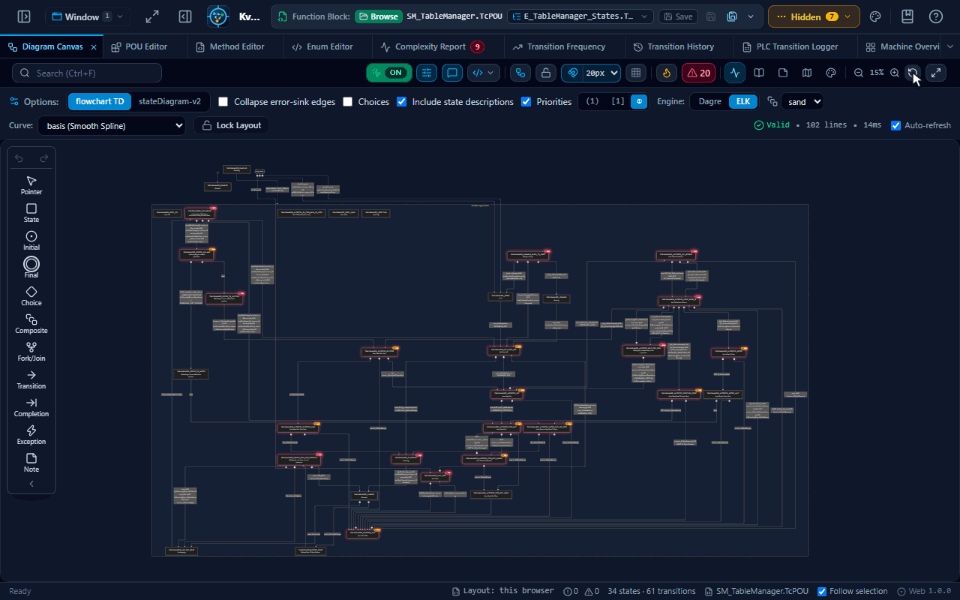
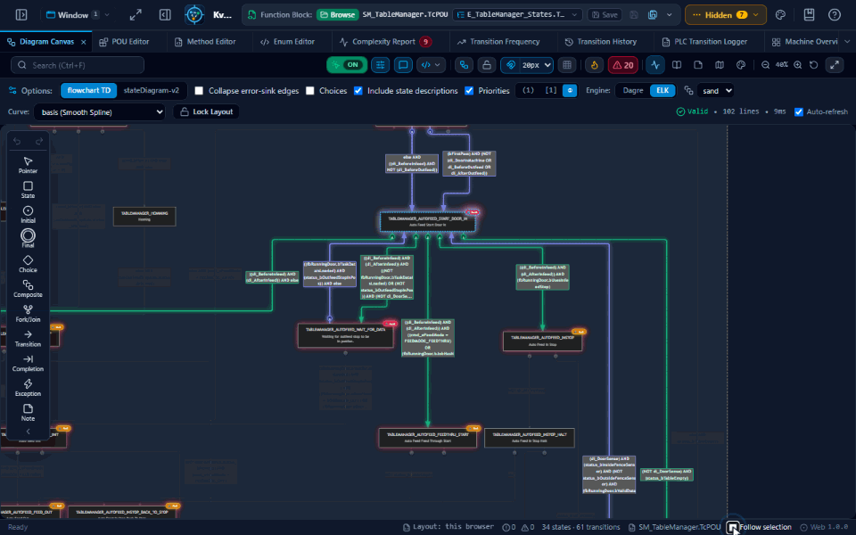
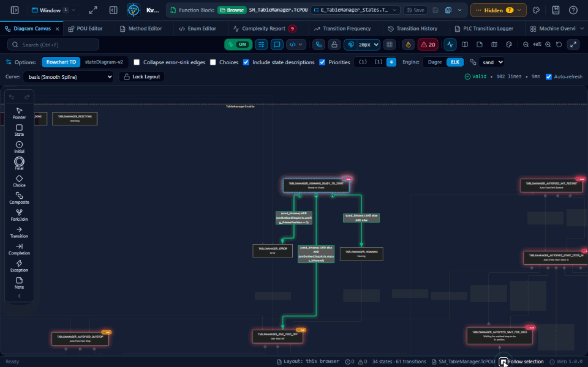
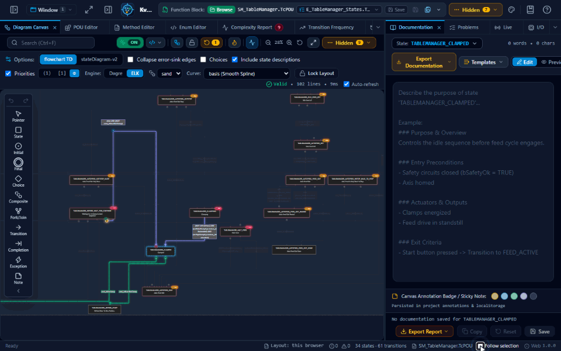
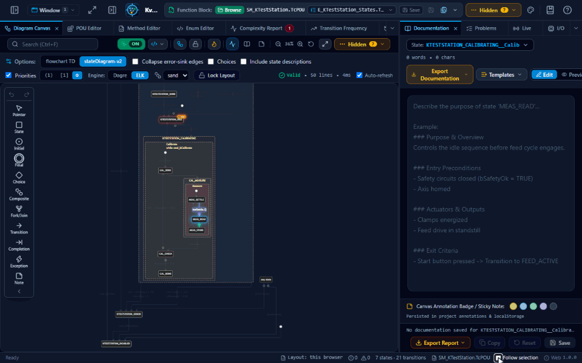
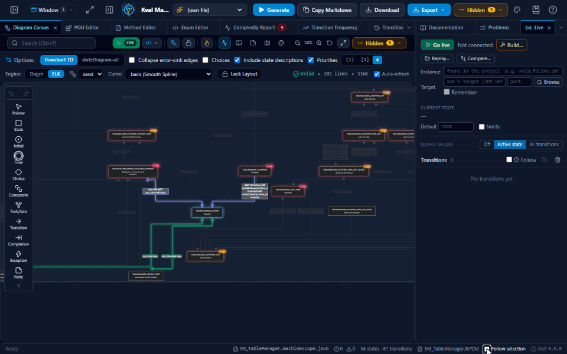
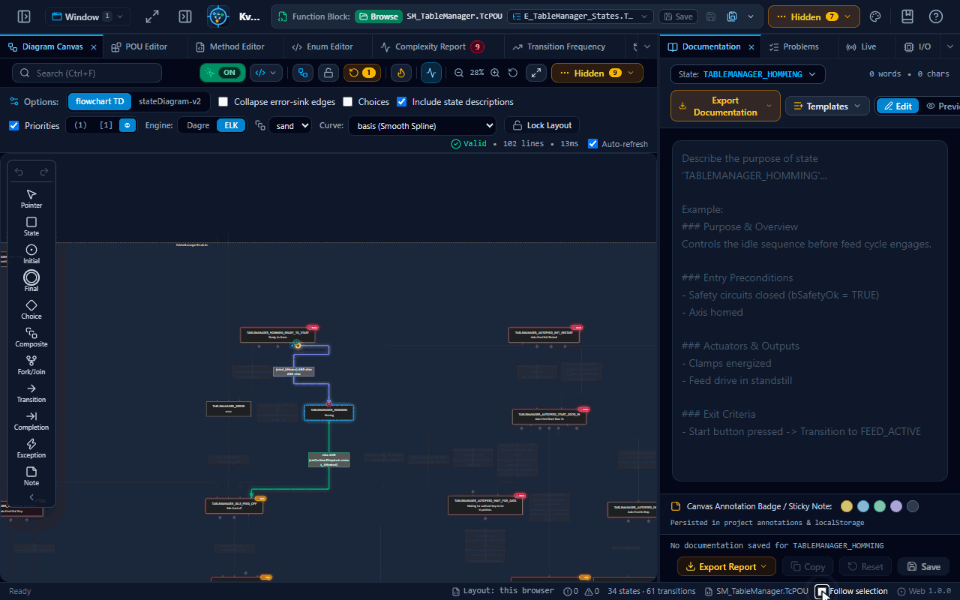
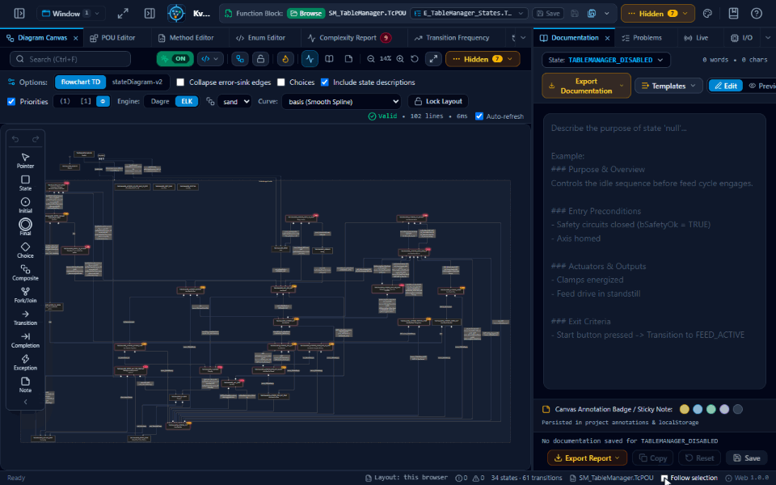
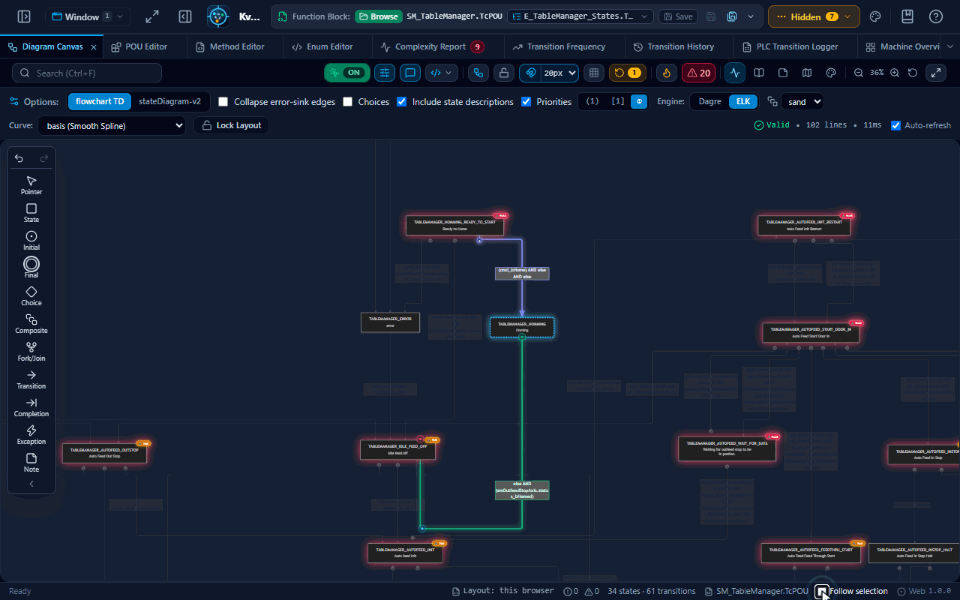

# Kval MachineScope

**Design, simulate and debug TwinCAT state machines and their I/O, live on the PLC.**

Kval MachineScope is a tool to design, edit, simulate and debug the Kval Inc. TwinCAT state machines (`SM_*.TcPOU` function blocks and their `E_*_States` enums). It reads the Beckhoff TwinCAT PLC Structured Text and draws the state machine as an interactive [Mermaid](https://mermaid.js.org/) statechart (`flowchart TD` with subgraphs or `stateDiagram-v2`): states, composites, choices and transitions are edited on the canvas or in the Method, POU and Enum Editors, compared in a Diff and saved back to the project. Live over ADS it follows the running PLC (its state, the guards' values, its symbols, its EtherCAT I/O tree with the linked variables' values, read-only), records and replays runs, and rebuilds and writes the project through TwinCAT XAE. It runs in the browser (with Link or a gateway for live access), as a desktop app, and inside TwinCAT XAE.

The generator extracts state logic and transitions directly from the `doState()` and `preProcess()` methods of a `SM_*.TcPOU` file together with the enum definitions in matching `E_*_States.TcDUT` files. If the POU includes a `doState_UmlSC()` method, embedded UML composite states are preserved and mapped into nested subgraphs.



## See it in action

All clips use the sample POU that ships with the app (`SM_TableManager`).

### Edit the state machine from the chart

Drag a transition's end onto another state and the `machineState := …` line in `doState()` is rewritten; **Go to code** shows the line. Drag a **State** from the palette and it is added to the enum and to `doState()`, where you dropped it. Every edit is one Ctrl+Z away.



### Straighten one transition

Right-click a transition with too many turns and choose **Re-layout edge**: it is redrawn straight, or with as few turns as it can, clear of the other states. Nothing else on the chart moves.



### Simulate without a PLC

The **Simulation** tab steps through the state machine: a state's transitions in the order the PLC checks them, each condition's result, values you set, **Step**, **Back** and **Take**.



### Sub-machines, running

A state whose branch calls a method with a state machine of its own has that method's states drawn inside it, and a state of that one calling another has its own inside it in turn (the K-Test Station sample: Calibrate(), then Measure()). Simulated, or live, the state glows and so does each level's current state inside it, step by step, the innermost moving first.



### Follow the PLC live

Go live from the desktop app, the TwinCAT XAE extension, or the browser (through Link or a gateway). The PLC's state glows on the chart, the transitions it takes fill the trail with their times, and **State times** shows how long it stays in each state, on the chart too. Every session is recorded: save it, replay it, compare two of them. (In this clip the PLC's values come from a stand-in, not a real PLC.)



### Checked as you edit

The chart is checked on every edit. Delete a transition and **Problems** says which state no transition reaches now; **Show in diagram** goes to it. Unreachable and dead-end states, missing CASE branches, duplicate or shadowed conditions and more are covered (see [Problems](#4-problems-state-machine-checks)).



### The machine's I/O

The **I/O** tab shows the EtherCAT I/O: offline from the TwinCAT project folder, live from the running master with each box's state. Each box, its channels and the PLC variables linked to them; the network as the boxes are cabled; a box's properties with its vendor, ports, documentation and front view.



### Share the layout through git

What you arrange on the chart (places, routes, notes, colours) is kept in `<POU>.machinescope.json` beside the POU: commit it and the team sees the same chart. A `git pull` that changes it is followed within seconds; a merge conflict in it is resolved in the app. (In this clip the web edition keeps it in a folder chosen in the status bar; the desktop app, the XAE extension and Link keep it beside the POU they opened.)



The clips are recorded from the app itself: `npm run demo:gifs` plays each scene (`scripts/demo/scenes.cjs`) in a headless browser and writes `docs/demo/*.gif` (`npm run demo:gifs -- <scene>` for one). The **Demo clips** workflow plays them again whenever the app's code changes (and weekly): a scene that no longer plays, has page errors, or whose clip runs much longer or shorter than the committed one is flagged in the run's summary, and the clips recorded anew are its `demo-clips` artifact, to copy into `docs/demo` after a look (`--check` locally). What a headless browser cannot show, such as the XAE edition in TcXaeShell or the installer, is recorded from the screen: `npm run demo:screen -- --out docs/demo/xae.gif --title TcXaeShell` records that window (or the whole screen) after a 3 s countdown until you press Enter, the pointer drawn in, and writes the GIF the same way.

---

## Workspace Layout

The workspace is organized like TwinCAT XAE / Visual Studio, in three resizable main panels separated by splitters:

| Panel | Contents |
|---|---|
| **LeftPanel** | Identified States |
| **MiddlePanel** | Document tabs: Diagram Canvas, POU Editor, Method Editor, Enum Editor, Complexity Report, Transition Frequency, Transition History, PLC Transition Logger |
| **RightPanel** | One tab group of tool windows: Documentation, Problems, Live, Changes, Paths, Keyword Search & Filter, Real-Time Stats, Complexity Heat-Map, Notes, Mermaid Markdown |

The diagram toolbar (search, view and editing controls) and the diagram **Options** toolbar live inside the Diagram Canvas tab, since they only apply to the canvas. The **Minimap** and the **Legend** are overlays on the canvas, opened from the diagram toolbar.

- **Help:** hover over the `?` icon at the right end of the header for how the app works, the diagram's mouse actions, the tabs and the keyboard shortcuts. Click it to keep it open; `Esc` or a click elsewhere closes it. The book icon beside it opens this README on GitHub (in the desktop app and XAE, in your default browser).
- **PLC Transition Logger** (MiddlePanel tab, also opened from Transition History): paste, drop or pick a CSV / text log of state changes, or load a sample. **Populate Transition History** sends it to the Transition History tab.
- **Focus mode:** `Z`, or the focus button in the header, hides the side panels, the header and the status bar, so the diagram fills the window. Press `Z` or `Esc`, or use the exit button, to bring them back.
- **POU Editor:** the POU's own Structured Text, as TwinCAT XAE shows it when you open the POU. The declaration (`FUNCTION_BLOCK ... EXTENDS ...`, `VAR_INPUT` / `VAR_OUTPUT` / `VAR ... END_VAR`) is on top and the body (the POU's implementation) below; drag the bar between them to resize. Both can be edited: **Save to POU** (Ctrl+S) writes them into the `.TcPOU` and leaves its methods as they are (those are in the Method Editor). Find searches both panels (Enter / F3), the body folds like the Method Editor's, and Reset goes back to the POU's code. Right-click (as in the Method Editor): **Go to Definition** (F12) highlights the variable's line in the declaration, or opens a method of the POU in the Method Editor; **Find References** searches for it in both panels; **Copy Symbol Name**; and in the body, **Toggle Block Fold** folds the block around the cursor. On a variable of another POU's type (`smAxis : SM_KAxis`, also `ARRAY [..] OF`, `POINTER TO` and `REFERENCE TO`), or on the type itself (after `:`, `EXTENDS`, `IMPLEMENTS`), the menu also offers **Open SM_KAxis in MachineScope**, which opens that POU of the same PLC project in the tab (**Back** in the status bar returns), and in XAE **Open SM_KAxis in the TwinCAT editor**. Go to Definition (F12) on the type itself opens it in MachineScope. This works in the Method Editor too, in the desktop app and XAE. Elementary types and the standard function blocks (`TON`, `R_TRIG`, ...) offer nothing. A body that is not Structured Text (SFC, FBD, ...) is left as it is; its declaration can still be edited.
- **Themes for the whole app:** **Theme & Preset** (the palette icon at the header's right end) holds the Theme and the diagram presets together. The Theme sets the app's look, not only the diagram's: **dark** (the default), or a light one: **default** and **base** (slate / zinc greys), **neutral** (plain greys) and **forest** (green-tinted greys). **IDE themes**, after popular IDEs' and editors': VS Code Dark+ and Light+, Visual Studio Dark and Light, JetBrains Darcula, JetBrains Dark (New UI) and IntelliJ Light, Monokai, One Dark Pro, Dracula, GitHub Dark and Light, Solarized Dark and Light, Nord: the app in their greys and accent, the chart in their colours (Mermaid's base theme with its variables; Mermaid Live and the exports too), the canvas their editor's background (`src/utils/ideThemes.ts`). Each has a preset of its own in the presets list. Identified States, the editors, Documentation, the header and every tab follow (`src/styles/appThemes.css`, made by `node scripts/gen-app-themes.cjs` from Tailwind's palette; the stylesheet's own colours, the scrollbars and the code's syntax colours too).
- **Expand** (the canvas toolbar, or Z): the canvas fills the window, the header and the side panels hidden, its toolbar on the canvas itself and the chart fitted; Esc (or the button again) brings them back.
- **The canvas' Grid** (its toolbar, beside Snap to grid): its dots, off by default and kept in this browser; snapping works with it off too (its dots shown only with the grid on).
- **Follow in the code editors:** the caret in a state's `CASE` branch (the Method Editor's `doState()`, or its Jump to State Case list) or on an enum member (the Enum Editor): its card in Identified States is scrolled to and framed, the other editor puts its caret on it (its member, its `CASE` label), and the Diagram Canvas selects it. The canvas pans to it only with that editor's **Follow** on (off by default, kept in this browser); the caret you are typing with stays where it is.
- **A state chosen** (Identified States, the canvas): the Method Editor's caret goes to its `CASE` label and the Enum Editor's to its member, each row highlighted until another state is chosen or the code is edited. A tab not on show scrolls there when it is opened. The card an editor's caret framed loses its frame when another state is chosen (`tests/web/state-pick-focus.test.cjs`: the editors floating beside the canvas).
- **Code views, as in Visual Studio / TwinCAT XAE:** in the Method Editor, the POU Editor, the Enum Editor, Mermaid Markdown and the Documentation tab (whose band covers the whole line, wrapped rows included; its Preview zooms too), the line with the cursor has a highlight band and a bright line number; it is dimmer when the view is not focused. In Mermaid Markdown, which is read-only, click a line or use the arrow keys, PageUp / PageDown and Ctrl+Home / Ctrl+End to move it. **Ctrl+mouse wheel** changes the text size (50% to 300%), as do Ctrl+Shift+. and Ctrl+Shift+, ; Ctrl+0 or a click on the zoom badge in the bottom-left corner goes back to 100%. The size is the same in all of them and is remembered.
- **Panels follow the selection:** selecting a state brings its **Documentation** forward, unless you are working in Live, Problems, Paths or Changes. Turn this off with **Follow selection** in the status bar.
- **Status bar:** messages appear in the status bar at the bottom rather than as pop-ups. It also shows the Live state, the number of changes and of problems, the state and transition counts, and the file with its unsaved / changed-in-XAE state. After opening a referenced state machine, it has a **Back** button. The lower-right corner shows the edition and its version (`Web 1.0.1`). Click it for the **Release notes**: each edition's releases, newest first, with what's new and what's fixed in each. The changes after the latest release in this build come first. A filter narrows the list. The notes come from the git history when the app is built.
- **A layout per host:** the layout inside XAE is saved separately from the browser / desktop one. It starts compact, with the LeftPanel hidden and a narrower RightPanel, to suit a document tab. Layouts saved by older versions get the new RightPanel once; your other tabs are kept.

### Loading a Function Block

The **Function Block** entry in the header toolbar (left of **Sample**) loads your own code: click **Browse** and pick a `.TcPOU` file, or drop one onto it. Only the file name is shown; the code is edited in the Method Editor and Enum Editor tabs.

The state enum is found automatically. By convention the `.TcDUT` sits in the same folder as the `.TcPOU` or in one of its subfolders, and that folder may hold several `.TcDUT` files. So after the `doState()` method is parsed, every `.TcDUT` in that folder tree is checked, and the one whose enum declares the most `doState()` CASE states is used. Build and library folders (`_Boot`, `_CompileInfo`, `_Libraries`, ...) are skipped.

- **Desktop app**: the folder is searched as soon as the `.TcPOU` is opened.
- **Web (Chrome / Edge)**: browsers do not reveal a file's folder, so the header shows **Find .TcDUT...**. It opens a folder picker at the `.TcPOU`'s folder; after you allow read access, later `.TcPOU` files inside that folder are matched without asking again. Dropping works the same way: drop the `.TcPOU` together with its `.TcDUT`, or drop the folder (its `.TcPOU` opens when it is the only one there, and any `.TcPOU` dropped or browsed from it later finds its enum). Inside another app's browser (VS Code's built-in one shows the page in a frame, without file access), **Browse** opens the plain file chooser, **Find .TcDUT...** lets you choose the `.TcDUT` files, and saving downloads the file; open the page in Chrome or Edge to save in place. If the browser lets you pick a file but then refuses to read it (its file access blocked for the page, by a policy or a site setting), **Browse** says so, and from then on uses the plain file chooser; saving then downloads the file.
- **Other browsers**: choose the `.TcDUT` file(s) directly; the best match among them is used.

When more than one `.TcDUT` matches, the header shows the count; click the enum name to pick another one.

### Inside TwinCAT XAE (prototype)

`xae-extension/` builds a Visual Studio extension (VSIX) for TcXaeShell 64-bit and Visual Studio 2022 / 2026. It adds **Open in Kval MachineScope** to the right-click menu of `.TcPOU` files and shows the app as a document tab in XAE. Inside XAE you get **Save to project** for edits, **Show in TwinCAT editor**, and a **Live** tab. The Live tab follows the state machine in the running PLC over ADS: the active state lights up on the diagram, and a trail lists every transition with its dwell time. See [xae-extension/README.md](xae-extension/README.md). The desktop app has the same Live tab for a PLC on another computer, without XAE (see [Live view in the desktop app](#live-view-in-the-desktop-app)), and so does the web edition, through a small helper on the same computer or a shared gateway (see [Live view in the web edition](#live-view-in-the-web-edition)).

### Working with tabs
- **Right-click a tab** for Close, Close All But This, Float, New Vertical Document Group (MiddlePanel) / New Horizontal Tab Group (RightPanel), and Move to Next / Previous Tab Group.
- **Drag a tab** onto another group's tab strip or onto the middle of a group to move it there, or onto a group's left/right (MiddlePanel) or top/bottom (RightPanel) edge to create a new group. Tabs can only be moved within their own panel.
- **Float a document**: double-click a MiddlePanel tab (or choose *Float*) to undock it into a window that can be moved and resized within the MiddlePanel. Double-click the window's title bar or use its dock button to dock it again.
- **Move a document to a window of its own** (outside the app, e.g. to another monitor): *Move to New Window* in a MiddlePanel tab's or floating window's menu, or the window button on a floating window's title bar. It is the same tab, with its content and state, in a browser window you can move anywhere. **Back to the app**, the dock button, or closing that window brings it back. The app's shortcuts work in them (keys pressed outside text fields go to the app). The windows close with the app. When it starts again, such a tab comes back floating, with **Reopen in its own window** (a browser opens a window only on a click). Dialogs such as prompts open in the main window. In a web browser the window shows the app's address with its name (e.g. `…/window.html?POU-Editor`): browsers always show a page-opened window's address. The desktop app and XAE show none.
- **Close a tab** with its `×` button or a middle-click.
- **Reopen closed tabs** from the **Window** menu in the header. A reopened tab returns to its original panel and tab group. The Window menu also shows/hides the Left and Right panels and resets the layout.
- **Resize** panels and tab groups by dragging the splitters; double-click a side-panel splitter to restore its default width.

### Several POUs at once
Each POU can have its own MachineScope, side by side:
- **XAE:** each POU opens in its own **MachineScope: <POU>** tab. Opening a POU that already has a tab brings that tab forward, without reloading it.
- **Desktop:** each POU opens in its own window, from Explorer, the command line or **Window > New Window**. Opening a POU that is already open brings its window forward. Each window has its own Live session.
- **Web:** **Window > New Tab** opens another browser tab.

**Several instances of one POU.** A POU can be declared more than once in the PLC program, for example `MAIN.fbLine1.smTable` and `MAIN.fbLine2.smTable`. After you go live, the Live tab lists every instance the PLC has, and marks the one this window follows. **Open** follows another instance in its own tab (XAE, web) or window (desktop), which goes live on it straight away. **Open all** does this for every other instance. An instance that already has its tab or window brings it forward. The title shows the instance, for example **MachineScope: SM_TableManager (MAIN.fbLine2.smTable)**. Each window keeps its own instance; the target and the other Live settings are shared by the POU's windows.

Notes are kept per POU, so two instances never overwrite each other's notes. Two tabs on the same POU stay in sync. Notes saved by an earlier version are moved to their POU the first time it is opened.

The layout (panel widths, tab groups, floating windows) is saved in the browser and restored on the next visit. Moving a tab never reloads its content, so the diagram keeps its zoom, pan and selection.

---

## Key Features

### 1. Interactive Diagram Canvas
- **Fluid Pan & Zoom**: Smooth gliding canvas navigation with mouse wheel zoom (up to 1000% of the chart's real size), fit-to-screen, 1:1 reset (the zoom label: a click goes between fitted and the real size), and full-screen presentation mode. The wheel over a right-click menu (a state's, a transition's) or a dialog on the canvas does not zoom.
- **Node Dragging & Custom Layouts**: Drag individual state nodes directly on the canvas to customize diagram positioning.
- **Auto-Align Diagram Engine**: Dedicated toolbar button and shortcut (`A`) to re-run the layout engine (ELK or Dagre) to cleanly organize all nodes according to current flowchart or stateDiagram-v2 logic while respecting the locked layout state. **Tidy up edges** (the canvas's right-click menu, the command palette) keeps the states where they are and draws each edge again from them, dropping its own waypoints, moved ends and moved label. With Dagre, edges that meet at one point of a state's side are fanned out along it (in the order of their other ends, so they do not cross), and transition labels on top of each other are moved along their own edges until they are clear.
- **Magnetic Snap to Grid**: Toggleable snap grid (10px, 20px, 40px) with real-time horizontal and vertical smart alignment crosshair guides.
- **Layout Locking**: Lock diagram layout to preserve custom manual positions across code edits or automatic re-layouts.
- **In-Place State Selection**: Click any node on the canvas to select it and highlight its transitions. The canvas and the layout stay as they are: no tab is opened. The Method Editor and Documentation tabs follow the selection when they are shown. In **Identified States**, clicking a state selects it the same way. **Go to State** (or the "Jump to state" picker) centers it on the canvas, and with **Follow** ticked a click does too.
- **State Style Window**: Click the selected state again (or right-click it and choose *Customize Style...*) to open the State Style window beside it: background, text and border colours plus quick presets. Click the state once more, or press Esc, to close it.
- **Transition Style**: Click a transition to select it, then double-click it to open the Transition Guard window. Its *Style* card sets the line colour, width and dash pattern, and the label's fill, text colour, font size, bold / italic / underline and border.
- **Crosshair / Jump to State**: Jump directly to any state from the sidebar, minimap, or legend with smooth centering and SVG-safe animated glowing highlight rings.
- **Interactive Minimap**: Live bird's-eye overview of the entire diagram, as an overlay on the canvas, with a draggable viewport indicator and quick-navigation clicks. It marks the selected states, and each bookmarked state with a ribbon: click one to go there. Its **All states** list shows only the bookmarked or only the changed states instead (the others dimmed), kept in this browser.
- **Interactive Diagram Legend**: A canvas overlay with a color-coded breakdown of states (initial, composite, logic, error sinks), transition priority markers, and note indicators.
- **Canvas Sticky Notes & Annotations**: Attach custom color-coded markdown notes to states or transitions directly on the canvas.
- **Transition Guard & Priority Overlay**: Double-click transition paths or priority badges to view guard conditions, trigger logic, and execution priorities.

### 2. Deep TwinCAT Structured Text Parsing
- **Dual Method Analysis**: Seamlessly extracts state transitions from `CASE stateVar OF` in `doState()` and pre-emptive condition handling in `preProcess()`.
- **Composite State Derivation**: Uses UML composite definitions from `doState_UmlSC()` or infers hierarchical grouping from enum declaration orders (e.g. states following `*_ENABLING` grouped into `*Enabled`).
- **Composite boxes** are drawn with a sand border, dashed, a faint tint of the same and their title in it, apart from the grey transitions and the states (dark theme: light sand; the light themes: a darker one). The style is part of the diagram's SVG, so SVG and PNG exports keep it.
- **Transition Priority Badges**: Detects sequential `IF...ELSIF` evaluation order and displays priority badges (Circle, Badge, or Text format) on transition lines. The selected transition's badge is amber (hover is sky blue), so its priority reads at a glance. Hovering a transition's label lights the transition and its badge too, and the guard popup is placed clear of the label (below, above, or beside it). After any move, a badge stays on its own transition, and badges that meet are moved apart along their transitions.
- **Error Sink Edge Collapsing**: Optional collapsing of high-density error/fault transitions to composite boundaries for cleaner, presentation-ready diagrams.
- **State Descriptions**: Automatically parses and attaches documentation comments and strings from `getStateDescription()`.

### 3. Real-Time Analytics & Complexity Heat-Map
- **State Machine Metrics**: Calculates total state counts, transition density, cyclomatic complexity index, Fan-In / Fan-Out metrics, and dead-end/unreachable state detection.
- **Visual Complexity Heat-Map**: Overlays real-time cyclomatic complexity metrics onto diagram nodes using customizable color scales (Traffic Light, Flame/Warm, Cool/Blue, Monochrome) with instant filtering for refactor candidates.
- **Interactive Metric Tooltips**: Hover over any state in heat-map mode to inspect LOC, branching factor, incoming transitions, and cyclomatic score.
- **Refactor Badges**: States above the complexity threshold show an `M=` badge on the canvas; click a badge to open the Complexity Heat-Map tab.

### 4. Problems (state machine checks)
The **Problems** tab (RightPanel) checks `doState()`, `preProcess()` and the rest of the POU against the `.TcDUT` enum and the diagram. The tab shows the number of errors and warnings, and states with an error or warning get a `!` badge on the canvas.

| Rule | Severity | Fix |
|---|---|---|
| Target not in enum: a transition assigns a state the enum does not declare | Error | Add to enum |
| CASE label not in enum | Error | Add to enum |
| Duplicate CASE label | Error | |
| No CASE branch: a state is entered but `doState()` has no branch for it | Warning (Info when an `ELSE` handles it) | Add CASE branch |
| Unreachable state: nothing in the POU leads to it | Warning | |
| Dead end: no transition out, in its branch or in `preProcess()` | Warning (Info for error-like states) | |
| Same guard, different targets: only the first can fire | Warning | |
| Self-transition, unused enum member, `CASE` without `ELSE` | Info | |
| Several initial states: more than one `// @initial` in one composite (or outside the composites) | Warning | |
| Parallel region without a final state: its join never fires | Warning | |
| Region state never entered: neither where its region starts nor a target in it | Warning | |
| Not declared: the code uses a name declared nowhere (the method, the POU, its base class, a GVL, a type of the project). Checked when the PLC project is known (XAE, desktop) and so is the POU's base class | Warning | |
| Not used: a `VAR` of the POU, or of a method, that its code never uses (inputs and outputs are the interface: not checked) | Info | |
| Declared twice in one declaration (Error), or a method's own variable that hides a member of the POU (Warning) | Error / Warning | |
| Input written: the POU assigns one of its own inputs (VAR_INPUT), which its caller overwrites every call. A command input (`cmd_...`) reset by the POU, and any input reset to FALSE, is the usual handshake and not reported | Warning | |
| Method not called: a PRIVATE method that no code of the POU calls | Info | |
| Never runs: code right after a RETURN in the same block | Warning | |
| FB never called: a timer, trigger or counter whose outputs are read but which is never called, so they never change | Warning | |
| Trigger on a constant: an R_TRIG / F_TRIG whose every call has the same constant CLK (`TRUE`, `FALSE` or a `VAR CONSTANT`), so its Q is never TRUE, or only in the first cycle. A call with FALSE that resets a trigger called elsewhere with its signal is fine | Warning | |
| Empty IF: an `IF … THEN` with nothing before its `END_IF` | Info | |
| Output never set: a VAR_OUTPUT no code of the POU writes (assigned, `S=` / `R=`, an FB output's `=>`, or passed to a call), so it keeps its initial value | Info | |

- **Scanning:** comments, strings and nested `CASE` / `IF` blocks are skipped over, so only the state `CASE`'s own labels and `ELSE` count.
- **Lifecycle states:** the enum members up to `…_ENABLING` are driven by the base class (enable / disable), so the unreachable and dead-end rules skip them. The diagram groups states the same way.
- **Per finding:** *Show in diagram* selects the state. *Open code* opens the Method Editor, or TwinCAT's editor at the line inside XAE. The fix button edits the `.TcDUT` / `doState()` like the editors do. *Ignore* hides a finding for that POU, and the tab keeps a count of ignored findings.

### 5. Editing from the diagram
Right-click a state or the canvas:
- **Filter the menu:** the menu of a state, a transition or the canvas opens with a filter box. Type part of a command ("bookm", "refer", "entry") to keep only the matching ones; the arrow keys and Enter run one, Esc clears the filter, then closes the menu.
- **Add state...** adds a member to the `.TcDUT` enum and an empty `CASE` branch to `doState()`.
- **Add new state from here…** asks for the new state's name, then the condition. It adds the state (an enum member at the end of the list, or last in the state's `{region}` composite, a `CASE` branch and a `getStateDescription()` line) and the transition to it at the end of the state's branch. The canvas then scrolls to it.
- **Add transition from here** starts a line from the state. Click the target state, then enter the condition. The transition is written at the end of the source state's branch, as `IF <condition> THEN machineState := <target>; END_IF`. `Esc` or a click on empty canvas cancels.
- **The condition field lists the POU's variables**, as TwinCAT's UML editor does: typing a name shows the variables that match it (doState()'s own and the POU's, with type and VAR block, the typed part marked). Arrow keys and Enter or Tab insert one; **Variables** or Ctrl+Space opens the list. A name that is not declared can be declared there: **Declare new variable…** asks for the scope (VAR_INPUT, VAR_OUTPUT, VAR), the type (guessed from the prefix: `bX` BOOL, `nX` INT, `tX` TIME, ...), an initial value and a comment. It is added to the end of that VAR block with the transition. A name used but not declared is pointed out (click it to declare it; a GVL's or a library's needs none). The same goes for exception transitions and Add new state from here.
- **Members after a dot:** `smAxis.` lists what the instance offers (an FB's inputs, outputs, public methods and properties, inherited ones too), `smAxis.stData.` a struct's members, `GVL_IO.` a GVL's variables, `E_Mode.` an enum's values. The names also include the project's GVL variables (not those of a `qualified_only` GVL, which are used as `GVL.x`), and the base class's members. In XAE and the desktop app the app reads the PLC project's types for this (their declarations); the web edition knows the loaded POU and enum.
- **The syntax is checked while typing:** brackets, a missing operand or operator, and the usual slips (`:=`, `==`, `!=`, `&&`, `||`, `!`, a `;`) are pointed out and the dialog waits until the condition is valid ST.
- **Go to code** (a transition's or its label's right-click menu, or the button in its Guard Condition popup): the Method Editor at its condition, in `doState()` (a state's transition) or `preProcess()` (an AnyState one), the line scrolled to, the caret on it and the editor focused (type at once); its line number and row stay marked until the caret leaves the line or the code is edited, as for a state picked elsewhere. An edge drawn from a composite's border opens its first transition (the others are listed in its popup).
- **Edit condition…** in a transition's menu, `F2` on a selected transition, or **Edit condition** in the Transition Guard window changes its condition, right on its label: a field over the label, with the same help (Enter changes it, Esc cancels). A transition without a condition gets a dialog by it, which says an IF is added. Its IF / ELSIF head is rewritten on one line; a composite's exception transition keeps its state range; a transition without a condition gets an IF. A transition in an ELSE is changed in the Method Editor. (Double-click still opens the Transition Guard window.)
- **Entry, do and exit actions**, as TwinCAT's UML editor shows them. Entry is the `IF bFirstPass THEN ... END_IF` block at the start of its branch (the first cycle in the state), exit an `IF machineState <> STATE THEN ... END_IF` block at its end (the cycle the state is left), do the rest of its code that is no transition. `IF(bFirstPass)THEN` without spaces counts too. **Actions** in the Options shows them under the states' names; they are changed with **Edit the state's code…** (below) or in the Method Editor.
- **Edit the state's code…** in a state's menu opens its whole `CASE` branch in `doState()`, as written (actions, transitions, comments), highlighted, and writes it back at the branch's indentation. Under the field, what changes (lines in, in green, and out, in red) before **Set code**; **Open in Method Editor** opens `doState()` at the state's `CASE` label instead.
- **Rename state...** renames it everywhere, as a whole word: in the enum, in every method of the POU, and in its notes, styles and positions on the canvas. The name is checked against the enum and ST identifiers first. In XAE and the desktop app, when other POUs of the project use the state (`E_States.STATE`, `STATE`), you are then asked whether to rename it there too; the dialog lists their lines, and those POUs are written at once.
- **Several states:** Ctrl+click a state to add it to a selection (or take it out), or Shift+drag a box on the canvas around them. The selected states get a dashed frame. Right-click one of them for their actions: bookmark (or remove the bookmarks of) all of them, delete all of them (one confirmation lists what goes), **Align** their left edges, centers, right edges, top edges, middles or bottom edges, **Distribute** three or more evenly (horizontally or vertically; with snapping on, the line and the places are on the grid), **Copy the N states** (`Ctrl+C`; then `Ctrl+V` pastes a copy of each, the transitions between them going to the copies, the copies selected), clear the selection. Dragging one of them moves them all, keeping their places to it; **Snap each to the grid when moved** (in their menu, kept per viewer) puts each of them on the grid as well (with snapping on). Esc or a click elsewhere clears it.
- **Undo / Redo of moves:** `Ctrl+Z` / `Ctrl+Y` also undo and redo moving states on the canvas (a drag, Align / Distribute, the arrow keys, a reset), in order with the code edits, also in the canvas moved to a window of its own. A state that goes and comes back (a delete undone, a paste undone and redone) keeps its place and its style.
- **Choices:** a choice diamond is drawn big enough to see and grab (**small / medium / large** next to Choices in the Options, kept per viewer). Moving it (ELK) keeps its transitions orthogonal, each on a corner of its own (top / bottom for a vertical end, left / right for a horizontal one), also when the chart is laid out again with the moves kept. A priority badge stays where it is when hovered (it grew and jumped back before, after its state had been moved). A transition's end dragged by a choice goes onto the diamond's corner nearest where it was dropped, square to it.
- **Copy state** (`Ctrl+C` with the state selected), then `Ctrl+V` or **Paste a copy of …**, adds a new state named `<STATE>_COPY`. It gets a copy of the state's code: the branch in `doState()`, its actions and transitions out, placed right after the original. A `machineState := <STATE>` inside the copy goes to the copy. Its line in `getStateDescription()` is copied with " (copy)", and it becomes a new enum member at the end of the list, so no other state changes value. The name is asked for straight away.
- **Delete state…** (`Delete`) shows what goes and asks first: the transitions into it (in `doState()` and `preProcess()`), its branches, and its enum member. It also lists what still refers to it, such as a range bound in `preProcess()`, for you to change. Members after it in the enum get new values when they have none of their own, and the dialog says so.
- **Setting a state's role:** **Set as initial state** (the machine's) and **Mark as final state** do the same as the palette's Initial and Final. **Initial state of <composite>** makes it its composite's initial state. **Move to composite…** moves its enum member into another composite.

#### Initial and final states in the enum
Mark a member with a comment on its line in the `.TcDUT`. The comment is ignored by the compiler, and the canvas writes and reads it:
```
TABLEMANAGER_IDLE_FEED_OFF,     // @initial
TABLEMANAGER_RESET_DONE,        // @final
TABLEMANAGER_ERROR              (* @final  the machine stops here *)
```
- **In a composite:** its `@initial` state is where it starts. The composite gets its own start node, and transitions into that state from outside point at the composite's border. Its `@final` states are its exits: each gets an end node in the composite, and their transitions out start at the composite's border. This keeps the canvas uncluttered. Without marks, the composite's entry is the state entered most often from outside, and its exit is its last enum member, as before.
- **Outside the composites:** `@initial` is the machine's initial state, unless the declaration or `initialize()` sets one. `@final` draws the state to the chart's end node.
- `(* final *)` on a state's `CASE` label in `doState()` also marks it final (the canvas writes it when no `.TcDUT` is loaded). A final state is not reported as a dead end.

Transitions:
- **Priority:** right-click a transition for **Raise priority** / **Lower priority** / **Priority n of m…**, or press `Alt+↑` / `Alt+↓` with it selected. The priority is the order of a state's transitions in its `doState()` branch. The IF / ELSIF arms of one IF swap (the first keeps `IF`), and so do separate statements. A comment right above an arm moves with it. An `ELSE` stays last, and transitions that share a block with others are left for the Method Editor. The message says which. For `preProcess()` transitions, the same items change their order there.
- **Moving an end:** drag a selected transition's end handle onto another state (the state is marked while you drag) to change its target (`machineState := NEW`). Drag its start handle onto another state to move its code (its IF, or its IF / ELSIF arm as an IF of its own) to the end of that state's branch, inside the IFs it was in. In an IF / ELSE of two arms, either arm moves as an IF of its own and the other one stays as one too: the ELSE becomes IF NOT (the condition), so the state behaves as before. The ELSE of an IF / ELSIF / ELSE moves as IF NOT (c1) AND NOT (c2) …, and a transition inside an ELSE moves inside IF NOT (its IF's conditions), as inside the IFs around it. Every transition of the samples can be moved so (`tests/unit/move-start-all-samples.test.ts` moves each one to three other states; `tests/web/endpoint-start-all-samples.test.cjs` drags them on the canvas). **The states stay where they are** when a start or an end is dropped on another state (locked layout or not), and when Ctrl+Z / Ctrl+Y undoes or redoes a code change, so you see where it went; one Ctrl+Z undoes the drop. Deleting a state or a transition from the canvas keeps the others where they are too, and Ctrl+Z puts a deleted state back where it was. **Only the transition you moved is drawn anew:** every other transition keeps its route and its label where they were, and the composites their boxes (the priority badges of the states involved renumbered); The moved transition keeps the stretch at its other end: still into its target at the same spot (a moved end: still out of its source), joined square to the new state from the side that keeps it clear of the other states. Its label sits halfway along its new route. A state dragged afterwards bends its transitions from their kept routes (each still at its other state where it was), and so does a kept transition's own handle dragged (its middle, its start or its end). A composite's box grows to hold its states when they are kept outside the box the layout drew (Lock Layout, a state dragged into a composite: it stays where it was dropped). A state is dragged into a composite, or out of it, in the state diagram as in the flowchart; the state diagram draws every state the flowchart draws (one with no transition and no description too, `tests/unit/statediagram-states.test.ts`). While a right-click menu is open, no hover popup (a transition's Guard Condition, a state's) shows over it. While routes are kept, the canvas says so (**Layout kept: n transitions as drawn**) with **Re-layout** at hand (Auto-Align). `tests/web/endpoint-start-all-samples.test.cjs` checks it after each drop and its Ctrl+Z; `kept-routes-drag`, `composite-grow` and `tests/unit/composite-members.test.ts` the rest; `drop-screens` compares screenshots of two drops (and their Ctrl+Z) with baselines. Released over or next to its own state, the end attaches to the side of the state it is by (also near a corner), and the line comes in square to that side, so the arrow head touches the border; the state flashes to confirm the connection. Dropped on empty canvas, the handles only reshape the line, as before.
- **Re-layout edge** (a transition's right-click menu): that transition is laid out again on its own, straight when its two states face each other, else with as few turns as it can (a turn counts as much as a long stretch), clear of the other states, out of its state and into the other one square to a side, away from the corners (a choice: at a diamond's corner). It avoids the other transitions' labels, running along their lines and ending on their ends when that costs little. Its label goes to its middle. The states, the other transitions and their labels stay where they are. The route is its own from then on (kept in the layout file by transition, under the layout engine it was made with): a state of it moved afterwards bends it from there, and its handles reshape it as before. Not offered for a transition back to its own state. **Ctrl+Z** puts its route back (and a dragged handle's change too: the transitions' routes are in the same undo history as the states' moves and the code), Ctrl+Y lays it out again, on the chart as it is. **Re-layout transitions** (a state's right-click menu) does it for all the state's transitions in and out, one after the other, each clear of the ones before it; one that would turn more than it does now is kept as it is; one Ctrl+Z puts them all back. The same for several states at once: **Re-layout their transitions** in a selection's menu (Ctrl+click the states, then right-click one), and **Re-layout its transitions** in a composite's title menu (its nested composites' states too). `tests/unit/edge-relayout.test.ts` checks the routing; `tests/web/edge-relayout.test.cjs` the menu on the sample's transition with the most turns (4 → 0), and `layout-file-xae` that it is written and drawn the same when opened again.
- **Delete transition…** (`Delete` with it selected) removes its code block after showing it.
- A click selects a transition. A **double-click** opens its Transition Guard window.

The edits land in the Method Editor and Enum Editor like hand edits: in the app's copy of the POU and the enum, until they are saved (see *Saving the files*).

**Undo / Redo:** `Ctrl+Z` and `Ctrl+Y` (or `Ctrl+Shift+Z`) on the canvas, or the arrows at the top of the palette, undo and redo edits to the POU and the enum. That covers the canvas' edits and the editors' saves. Edits within a second of each other are one step, the history keeps 100 steps, and opening another file starts a new one. Inside a text editor, `Ctrl+Z` is that editor's own undo.

**Composites by dragging:** a composite dragged by its title into another composite's box nests its `{region}` block there (its states and sub-composites with it); released outside the composite it is in, it moves out. **Collapse to one box** (a composite's right-click menu) draws it as one box with its transitions in and out (a view: the code is not changed); **Expand** in the box's menu. Drag a state into a `{region}` composite's box to move its enum member into that composite; drag it out to move it out (its enum line kept whole: comments, values, `@initial` / `@final`). **Shift** + a box around states offers to group them into a new composite. Drag a composite by its title to move it with all its states (the enum is not changed). **Ungroup** in a composite's right-click menu removes its `{region}` / `{endregion}` lines; its states stay, outside any composite.

**A condition edited from its popup:** hover a transition's label, and the pencil in its popup opens the condition editor on the label; the new condition goes into the code where the transition is (doState(), preProcess(), or a sub-machine's method).

**ELSE as condition** (an option next to **Choices**): a transition under an IF's `ELSE` is labelled with what that ELSE means, `NOT (cmd_bStart)`, instead of `else` (longer labels; off by default).

**A CASE inside a state's branch** (on a step number or another variable, not the states) guards what is under its arms as an IF would: a transition under `2:` reads `iStep = 2`, one under `1:` inside `IF cmd_bA` reads `(iStep = 1) AND (cmd_bA)`, `5..7:` is a range and the CASE's `ELSE` is the IF's `else`. With **Choices** on, its arms are the branches of the state's choice, and an arm holding an IF of two or more transitions leads, labelled with the arm's condition, to a choice of its own. The same goes in a sub-machine's method. A label, its IF and its assignment can share a line (`1: IF cmd_bA THEN … END_IF`).

**Sub-machines:** when a state's branch in `doState()` calls a method of the same POU whose body is a state machine of its own (a `CASE` on its own variable, such as a `VAR_INST` of another enum: `EFX_IDLE` calling `RpsSimulation()` in its test mode), the chart draws the state as a box titled with its own name. Inside it, the method's states sit in a box of their own, headed by the method's name (**RpsSimulation**) and drawn by their own names. Its entry arrow says when it starts: the call's argument for the input its start is set under (a rising edge's `Q`: **↑ cmd_bRpsTestMode**). That header says when it runs (the IFs around the call) under the name, and states nothing goes to are dashed, **never reached**. The state's own transitions still leave from its box. Drawn expanded by default; **Collapse sub-machine** (either box's title menu) draws the state as one state again, its label marked **⊞ RpsSimulation**, and **Expand sub-machine** (its menu) shows it again. Kept per POU, in the layout file too. **Go to code** on a sub-machine's transition, its entry or one of its states opens the Method Editor at that line of the method. Its transitions' ends are dragged onto its other states (or **Move start to… / Move end to…** in a transition's menu, which lists its own states): the end changes the assignment's target in the method (`iTestModeState := E_RPS_TEST_SEQ.IDLE`, its qualifier kept), the start moves the transition's `IF` block to the end of the other state's branch there; Ctrl+Z undoes either. A drop outside the sub-machine is refused, and its entry's start is changed in the code. A click on one of its states shows its `CASE` label in the method; a click on the box's blank area selects the state itself. Hovering one of its states shows its branch of the method; hovering the box's blank area shows the state's own code in `doState()`.

Sub-machines nest: when a sub-machine's state calls another method with a state machine of its own, that one is drawn in a box inside that state, up to four levels deep. Each level collapses on its own, and collapsing an outer one hides the ones inside it. Everything below applies at every level: the simulation runs them as a chain (the innermost's transitions offered first; a `RETURN` after a call holds back the transitions of the code around that call only), and live, each level's variable is read and its state marked.

While the state is current, its sub-machine runs with it:

- **Simulation:** set the call's condition (`cmd_bRpsTestMode` TRUE) and the sub-machine starts in its first state. The state glows, and its sub-machine's state glows inside it. Its transitions are offered first, in the order its `CASE` checks them. The state's own transitions wait when a `RETURN` follows the call, but `preProcess()`'s are still checked. **Step**, **Take** and **Back** move through it. The panel shows **Sub-machine RpsSimulation() in IDLE**, and the steps list it by its own names. Clear the condition and it stops.
- **Live:** the state glows and its sub-machine's state, read from the PLC, is marked inside it. The method's variable is a `VAR_INST`. It is read as `<instance>.<method>.<variable>`, or found among the instance's members by the method's and the variable's names when the PLC keeps it under a name of its own. Its value is named by the PLC's enum, or by the method's `.TcDUT` when it is open. Each level's steps are kept with the session: the Live tab's trail lists them between the transitions, indented and labelled with their method (`Measure(): MEAS_SETTLE → MEAS_READ`), and a saved recording replays them.
- **Priorities:** a sub-machine state with several transitions has them numbered on the chart, in the format chosen. **Raise / Lower priority** (a transition's menu, or Alt+↑ / Alt+↓) reorders them in the method. The state's own transitions keep their badges on its box.
- **Identified States:** the state's card and its sub-machine share one box, with the sub-machine's states listed by their own names and in / out counts. Its **▸ RpsSimulation()** toggle expands or collapses the sub-machine on the canvas too, and the canvas' **Collapse / Expand sub-machine** changes the list. Selecting one of its states anywhere selects and scrolls to its card; a click on its card selects it on the canvas (with Follow on, the canvas pans to it). While it is simulated or live, its current state's card is marked. Right-click a card (one of its states' too) for **Go to code**, its `CASE` label in the Method Editor, and **Add bookmark**.
- **Enum Editor:** hover a member (its line, or its row in the table) for its state's `CASE` branch. With one of its states selected, the Enum Editor shows the sub-machine's enum at that member: its `.TcDUT` when it is among the files found with the POU (edited there, as the main enum is: **Save** writes that file), else its states as read from the method's `CASE` labels (read-only). The caret on a member selects that state on the canvas and in Identified States, and the Method Editor shows the method at its `CASE` label; the Method Editor's caret in one of its branches does the same the other way.
- **Complexity heat map and statistics:** each of its states is scored from its own branch of the method. The state is scored from its own code in `doState()`, with its badge at the box's top-right corner and the box's frame in its level's colour. The statistics count its states and transitions. The statistics panel's **Summary** and the **Complexity Report** have a section per sub-machine (nested ones indented): where it runs and while what, its states and transitions, its most complex and average state, the states nothing goes to; a click on a state selects it.

**Choices** (in the options, off by default): a state's top-level `IF / ELSIF / ELSE` with two or more of its transitions in different arms is drawn as a choice. That is a diamond the state goes to, with each arm's transition leaving it. An arm is its state's transition: **Edit condition** (on its label, or F2), its priority, and dragging its end onto another state all work as on any transition. Its start stays at the choice, since the arm is part of that IF.

### Statechart palette
The toolbar on the left of the canvas holds the elements of TwinCAT's UML statechart toolbox. Drag one onto the canvas, a state or a composite; clicking one uses the selected state instead. Each becomes Structured Text:

| Element | Dropped | Written to |
| --- | --- | --- |
| **Pointer** | (click) | Ends drawing a transition |
| **State** | on the canvas, or in a composite | An enum member (at the end, or last in the composite), a `CASE` branch in `doState()`, a line in `getStateDescription()`. It is placed where you dropped it, in a composite too (its box grows to hold it), whatever the zoom: at the nearest spot that covers no state and, when it can, no transition's label and few lines; on the grid while Snap to Grid is on |
| **Initial** | on a state | In a composite: that composite's initial state (`// @initial` in the enum). Elsewhere: the machine's, the state variable's initial value in the declaration (`machineState : E_X := STATE;`); when the base FB declares it, it is set in `initialize()` after `SUPER^.initialize()` |
| **Final** | on the canvas / on a state | A new final state / the state marked final or not: `// @final` on its line in the enum (`(* final *)` on its `CASE` label without a `.TcDUT`). In a composite its transitions out start at the composite's border |
| **Choice** | on a state | Conditions and targets (and an optional `ELSE`) as `IF / ELSIF / ELSE` at the end of its branch |
| **Composite** | on a state / on the canvas | `{region "Name"}` … `{endregion}` around its enum member(s). Regions can be nested; TwinCAT's editor folds them. A composite's members are consecutive, as `preProcess()`'s `>= FIRST AND <= LAST` scopes expect |
| **Transition** | on the source state | Then click the target and enter the condition: `IF <condition> THEN machineState := TARGET; END_IF` at the end of its branch |
| **Completion** | on the source state | Then click the target: `machineState := TARGET;` with no condition, taken once the state's code has run |
| **Exception** | on a state / in a composite | Then click the target and enter the condition. Checked first: the state's branch becomes `IF <condition> THEN machineState := TARGET; ELSE <branch> END_IF`. From a composite it goes in `preProcess()`: `IF machineState >= FIRST AND machineState <= LAST AND (<condition>) THEN …` |
| **Fork/Join** | on a state | Parallel regions inside the state: each a state variable of the enum's type (declared in the POU, e.g. `regionA : E_X;`) and its states (new enum members, a `CASE regionA OF` in the state's branch; the last one final). On entry (`IF bFirstPass THEN`) every region starts in its first state (fork); the state goes to the target when every region is in its final state (join: `IF regionA = A_DONE AND regionB = B_DONE THEN machineState := TARGET; END_IF`). The chart draws the regions inside the state. Transitions drawn between a region's states set its variable (`regionA := …`); one into another region is refused. Live, the state glows and each region's current state is marked (the app reads the region variables too) |
| **Note** | on the canvas | A sticky note with its corner exactly where you dropped it (the canvas's only: left out of the exported Mermaid text, Mermaid Live, the code view and copies, since it belongs to no state) |

### 6. Paths, changes and referenced state machines
- **Paths** tab: pick two states, or right-click a state and choose *Paths from here* / *Paths to here*. It lists the paths between them, with each step's guard, shortest first, and highlights them on the diagram. Click a path to show only that one. The search stops after 25 paths.
- **Changes** tab: what changed compared with the saved file (in XAE: the version XAE has saved), or with the committed git version (desktop and XAE). It lists states added or removed, states whose code changed, and transitions added or removed or with a changed guard. *Show on the diagram* colors new states and transitions green and changed ones amber.
- **Referenced state machines:** when a state's code or a transition's guard uses another state machine (a member such as `smOutfeedStopAxis : SM_KAxis`), the context menu offers *Open SM_KAxis (smOutfeedStopAxis)*. It opens that POU from the same PLC project (desktop and XAE), and **Back** in the status bar returns to the previous one.

### 7. Documentation for a whole project
**Export > Document all state machines** makes one HTML file for every state machine (every POU with a `doState()` `CASE`) in the PLC project. Each gets its chart, a table of states (description, transitions in and out, `CASE` branch present), a table of transitions with their guards, and its Problems. A contents list links to each. The file is self-contained and prints to PDF one state machine per page.
- **Desktop and XAE:** the POUs are found in the loaded POU's PLC project, and a save dialog asks where to write the file.
- **Web:** choose the project folder; the file is downloaded.

### 8. TwinCAT Source Editors & Inspection
- **Identified States Sidebar**: Filter states by name, logic presence in `doState()`, error sinks, or composite groups; sort alphabetically or by enum index; jump to any state with 1 click.
- **Integrated Enum Editor (`.TcDUT`)**: In-app editor for TwinCAT enum definitions with syntax checking and member management.
- **Integrated Method Editor (`.TcPOU`)**: Embedded editor for `doState()` and `preProcess()` Structured Text blocks.
- **Bookmarks**, as TwinCAT's PLC Bookmarks: right-click a state on the canvas or in Identified States for **Add bookmark** / **Remove bookmark**. A bookmarked state has a ribbon on the canvas and a bookmark on its card, and the Method Editor marks its `CASE` label line in the gutter. In the Method Editor's implementation, right-click a line for **PLC Bookmarks**: *Toggle Bookmark* (`Ctrl+F2`), *Next Bookmark*, *Previous Bookmark*, *Clear All Bookmarks* (this method, or the whole POU). Toggling a state's label line toggles the state's bookmark, so the canvas shows it too; other lines keep their text, so a bookmark stays on its line when lines above it change. The POU Editor's body has PLC Bookmarks too. **Show All Bookmarks…** (in the submenu, a state's or the canvas's menu, or Identified States) lists every bookmark of the POU; a click goes there. Hovering a state on the canvas shows its whole code (its `CASE` branch, as written) at once, Structured Text highlighted, one line on one line, the names the Problems tab flags underlined and those problems listed (in the heat-map's box when that one shows). The box sits just below the state, or above it when there is no room, never over it. On the canvas, **F2** / **Shift+F2** (no transition selected) go to the next / previous bookmarked state. **Alt+F2** / **Shift+Alt+F2** (anywhere), or the arrows in the Bookmarks list, go to the next / previous bookmark of any section (states, methods, the declarations, the enum), opening its editor. The declarations of the Method Editor and the POU Editor, and the Enum Editor, have bookmarks too. A bookmark can have a name: the pencil in the Bookmarks list. **Export** / **Import** there share them as a file (`<POU>.bookmarks.json`: the states, lines and names; Import adds them to the POU's own). A state has one bookmark wherever it is set: its card, its ribbon on the canvas, its `CASE` label, its member's line in the Enum Editor. A click on a bookmark mark toggles it (an editor's margin: a faint mark on hover sets one; the canvas' ribbon; a card's icon). Bookmarks are kept per POU in this browser / app.
- **Code help in the editors** (POU Editor, Method Editor), as in TwinCAT:
  - **Completion:** Ctrl+Space lists the names the code can use (the method's, the POU's and its base class's, the project's GVLs), and a dot lists the members of what is before it (an FB instance's inputs, outputs, methods and properties, a struct's members, a GVL's variables, an enum's values). Arrows move, Enter or Tab inserts, Esc closes; Ctrl+Z undoes the insert.
  - **Input Assistant** (F2): every name by category (variables, inherited, global variables, states, enum values, types, the standard ones), with a search; Enter or a double-click inserts it.
  - **Hover** a name for its type, VAR block and comment.
  - **Parameter hints:** in a call (`fbTimer(`, `smAxis.home(`, a function), a box above the line lists what it takes: its inputs, in-outs and outputs (`=> Q`) with their types, the one being typed marked (by position, or by name after `IN :=`). The standard function blocks (TON, TOF, TP, R_TRIG, F_TRIG, CTU, CTD, CTUD, RS, SR) are known too, and complete after a dot (`fbTimer.` → Q, ET, …).
  - **Snippets:** a key and Tab puts in a piece of code, indented like its line, the caret where you type next: `if`, `ife`, `elsif`, `case`, `for`, `while`, `repeat`, `ton`, `rtrig`, `trans` (a transition), `entry`, `exit`. Your own: the command palette's **Edit snippets…** (kept in this browser; yours come first).
  - **Format Document** (Shift+Alt+F, or the menu): every line re-indented with tabs by its blocks (IF / ELSIF / ELSE, CASE labels and their code, FOR, WHILE, REPEAT, VAR blocks), a condition going on over several lines one level further. Only the indentation changes; Ctrl+Z undoes it.
  - **Problems in the code:** a name that is not declared, a variable declared twice or not used is underlined (red, amber, blue), its message on hover. The Problems tab has **Declare…** for a name that is not declared (in its method, or the POU), **Remove** for an unused variable (after showing its line), **Insert call** for a function block that is read but never called (`fbTimer(IN := FALSE, PT := T#0S);` above its first use, to fill in), **Remove the lines** for code after a `RETURN` that never runs (to the end of its block), **Add ELSE** for a state machine's `CASE` without one (before its `END_CASE`), **Remove method** for a PRIVATE method nothing calls, **Delete state…** for a state no transition leads to, **Remove from enum** for an enum member nothing uses, **Add PT** for a TON / TOF / TP called without its time (`PT := T#1S` in its first call, to change), **Add description** for a state `getStateDescription()` has no line for (a line like the others, the text from the state's name), **Remove the call** for a trigger on a constant whose Q is never TRUE (its one call, since removing it changes nothing), and **Remove the empty IF** (when its condition calls nothing). Each shows what changes first.
  - **Live values in the code:** while live, the Method Editor shows the current value at the end of each line for the POU's variables that line uses. Right-click a name for **Watch x in Live**: it is listed at the top of the Live tab with its value (kept per POU; **Stop watching** there or in the menu).
  - **Go to Symbol** (Ctrl+T or Ctrl+Shift+O, or the palette): the POU's states, methods and members and the project's types and GVL variables in one list with a filter. A state goes to it on the canvas, a method opens in the Method Editor, a property's Get / Set too (`bReady.Get`: edited and saved like a method, in the property), an action too (its code; an action has no declaration of its own), a member at its declaration, a type in MachineScope (a POU) or TwinCAT's editor.
  - **Outline** (the list button next to Unfold All in the Method Editor): the method's blocks (CASE branches, IFs, loops) and the calls of methods and FB instances, the caret's one marked. A click goes there (the blocks around it unfolded).
  - **Find All References** (Shift+F12, or the menu; a state's menu on the canvas too): every use in the POU's declaration, body, methods and guards, marked as declaration, write or read. A state's uses as `E_States.STATE` count. A click opens it at the line.
- **Refactoring in the code editors** (POU Editor, Method Editor), from the right-click menu:
  - **Go to Definition** (F12) on a member of another POU's instance (`smAxis.bDone`) opens that POU at the member: its declaration line in the POU Editor, or its method in the Method Editor (XAE, desktop). In XAE, **Open SM_KAxis.bDone in the TwinCAT editor** opens TwinCAT's editor there.
  - **Declare x…** (Shift+F2, as TwinCAT's Auto Declare) on a name the code uses but nobody declares: scope, type (guessed from its prefix), initial value and comment. In the Method Editor it goes into the method's declaration, or with **Declare x in the POU…** into the POU's (written at once).
  - **Rename x…** on a variable of the POU renames it in its declaration, body, methods, properties and the guards, as a whole word. A member of something else (`other.x`) and a call's named parameter (`fb(x := 1)`) stay; a method with its own `x` keeps it. The dialog previews every changed line. For an input or output, XAE and the desktop app also look in the other POUs of the PLC project: its uses there (`instance.x`, `inst[i].x`, `pInst^.x`, a named parameter `instance(x := …)`) are renamed too, listed in the preview, and those POUs are written at once when you confirm (each only if it did not change since it was read). In the web edition (Chrome, Edge) the project folder is asked for once, and its POUs are searched and written back the same way; in other browsers they keep the old name, and the dialog says so. Live watches are not changed. In the Method Editor, a method's own variable is renamed in that method. Save first: it works on the saved POU.
  - **Shift+F6** renames the name at the caret in place: a field at the name, and its uses in the editor highlighted while it is open. Enter renames, as Rename… does (in the POU, and in other POUs of the project where they use it). Esc keeps the name.
  - **Rename method…** / **Rename property…** / **Rename action…** on its name: its declaration and every call in this POU; XAE, the desktop app and the web edition (Chrome, Edge: the project folder) also rename its calls in the other POUs of the project (`instance.Method(`), listed first.
  - **Extract Method…** on selected whole lines of a method: they become a new method and a call to it. The method's own variables they read become its inputs; the ones they only set (their first use an assignment) its VAR_OUTPUTs (`nTmp => nTmp` in the call); the ones they read and change its VAR_IN_OUTs. A preview shows the call and the new method. Lines with a `RETURN`: the new method returns TRUE when it RETURNed and the call becomes `IF New(...) THEN RETURN; END_IF`, so the method still leaves there. Half a block, an ELSE / CASE label, or lines that set the method's own result and RETURN cannot be extracted.
  - **Extract Action…** on selected lines that use only the POU's members (no variable of the method, no `RETURN`): a new Action of the POU, `Name();` in their place.
  - **Extract Property…** on a selected expression of one line: a new PRIVATE property (its Get returns the expression), its name in the expression's place. Its type is guessed (a comparison or logic: BOOL; a timer's `.Q`: BOOL; one variable: its type) and can be changed in the dialog. An expression using the method's own variables cannot become a property (it sees only the POU's members).
- **Custom State Styling Inspector**: Customize fill colors, stroke colors, and borders for individual states with instant live preview.

### 9. Export & Tooling
- **Dual Mermaid Formats**: Switch instantaneously between `flowchart TD` (with subgraphs) and `stateDiagram-v2`.
- **Curve Algorithms**: Customize flowchart routing curves (basis, linear, cardinal, natural, step).
- **Mermaid Live Integration**: Open generated diagrams directly in [mermaid.live](https://mermaid.live) with 1 click.
- **One-Click Export**: Copy Mermaid Markdown to clipboard, download `.statechart.md`, or export diagram graphics.
- **Diagram Presets**: Save and apply combinations of layout engine, curve, theme, priority format and export settings (PNG/SVG, 1x–4x scale, dark/white/transparent background). *Export with Preset* downloads using the active preset's export settings, and the High-Res Export dialog opens with them preselected.

---

## Pre-Loaded Production Samples

Test the generator immediately with 7 real-world Beckhoff TwinCAT state machine samples, and one written to show sub-machines:
1. **Door Dasher (`SM_DoorDasher`)**: Complex multi-level state machine with nested UML composite states (`Disabled`, `Enabling`, `Enabled`, `Stopping`).
2. **Table Manager (`SM_TableManager`)**: Indexing rotary table sequencer with error handling and interlocks.
3. **K-Motor VFD (`SM_KMotorVFDEtherCATi550`)**: EtherCAT Lenze i550 variable frequency drive velocity/position controller.
4. **K-Analog Measure (`SM_KAnalogMeasure`)**: Analog sensor sampling, calibration, and zeroing sequence.
5. **Feed Manager (`SM_234FeedManager`)**: Material feeder sequencing and fault recovery logic.
6. **K-Servo Supply Manager (`SM_KServoSupplyManager`)**: Finds the servo power supplies and enables them as child state machines.
7. **K-Power Supply AX86x0 (`SM_KPowerSupplyAx86x0`)**: Beckhoff AX86x0 servo power supply enable, reset and error handling.
8. **K-Test Station, nested sub-machines (`SM_KTestStation`)**: `KTESTSTATION_CALIBRATING` calls `Calibrate()`, a state machine of its own, whose `CAL_MEASURE` calls `Measure()`, another one: both drawn in boxes inside their state. `KTESTSTATION_TESTING` steps through a `CASE iTestStep OF` of its own, its arms guarding its transitions (with **Choices** on: a choice's branches).

Samples 6 and 7 use a `{attribute 'qualified_only'}` enum, so their code names states with the enum's type: `E_KSupplyManager_States.DISABLED:` and `machineState := E_KPowerSupply_States.ERROR;`. Both forms are read everywhere: in `doState()` and `preProcess()`, the Identified States, the Method Editor and Problems. Code the app writes (a new state's CASE branch, a new transition) follows the style the POU already uses.

---

## Getting Started

### Prerequisites
- Node.js (v18 or higher recommended)
- npm or pnpm

### Saving the files
Edits (the canvas', and an editor's **Save** / `Ctrl+S`, which puts its code into the POU) change the app's copy of the `.TcPOU` and the `.TcDUT`. The header's **Save** button counts the files with unsaved edits, and so does the status bar. Saving writes them:

| Edition | Save | ▾ menu |
|---|---|---|
| **XAE** | **Save to project**: into the TwinCAT project. A file changed in XAE since it was loaded is refused unless you chose *Keep mine* | |
| **Desktop** | Back to the files they were opened from, with their BOM (as TwinCAT writes them). A sample, which has no file, is saved with Save As | **Save .TcPOU As… / Save .TcDUT As…** |
| **Web, Chrome / Edge** | Back to the file opened with **Browse** or dropped on the header, and to the enum found in the folder you granted. The browser asks for write access once | **Download .TcPOU / .TcDUT** |
| **Web, other browsers** (or a sample) | Downloaded, to replace the original with | **Download** |

- **`Ctrl+S`** saves the files (outside an editor). In an editor it first puts the editor's code into the POU, then saves the files when they can be written in place.
- **A file changed on disk since it was opened** (saved in TwinCAT or another editor): Save asks before overwriting it. Files that did not change are saved.
- **Save and Save All in the header** (the icons beside Save / Save to project): **Save** puts the edits of the editor you used last (the Method Editor, the POU Editor, the Enum Editor, a state's code) into the POU and writes the files, as `Ctrl+S` does; **Save All** puts every editor's edits in first (the count on it: how many have edits not in the POU yet), and the app's other windows (desktop app), tabs (web edition) and MachineScope tabs (XAE) save theirs too; it says which ones did.
- **An editor's changes:** its tab shows `*` while it has edits not saved (its own, or its file's: the tooltip says which). **Diff** in the editor's toolbar, or a click on the `*`, shows them line by line against what it last saved, by section; with no edits of its own, its file's changes since it was saved (the canvas' edits too). It is disabled when there are none. The Diff's toolbar (and a change's right-click menu): **First / Previous / Next / Last** change (Alt+Home, Shift+F8, F8, Alt+End), **Undo change** (that change only, its lines as before) and **Redo change**; a line is edited in place with a double-click or F2. **Context**: 3 lines, 10 lines or the whole code (the default) around the changes. Ctrl+wheel sets its text size. **Split** view (the default: the text before on the left, the changed text on the right, line by line; within a changed line, the words that changed are marked on both sides) or **Unified** (one column), kept in this browser. Its **Dock** button puts it in a tab of its own beside the Diagram Canvas (**Float** brings the popup back). It keeps reading its source: when the code changes meanwhile (typed in the editor, a canvas edit), it says so and offers **Reload**; its own Undo change and line edits show at once. **All changes** (the Save ▾ menu, the command palette) shows: every editor's edits not in the POU yet, and the files' since they were saved. States whose code changed since the POU was saved have an amber dot on the canvas and the minimap, and "changed" in the canvas's search. **Save to file** (beside an editor's Save, or `Ctrl+Alt+S` in it) puts its edits into the POU and writes the files in one step.
- **Unsaved edits are not lost silently:** opening another POU (Browse, a drop, a sample) asks first, and closing or reloading does too (the desktop app asks in a dialog). What is kept per viewer (layout, notes, styles, positions, options) is never the code.

### Command palette and shortcuts
- **Ctrl+Shift+P** opens the command palette: every command of the app in one list with a filter (all the words typed, in any order): the selected state's and the canvas's menu commands, "Go to" every state, "Open" every method, "Show" every tab, the view options (actions on the states, descriptions, priorities, the layout engine), Save, Undo / Redo, the bookmarks, the shortcuts, Go to symbol, Edit / Export / Import snippets. Arrows and Enter run one. With nothing typed, the commands run last come first ("recently used").
- **Snippets as a file:** **Export snippets to a file…** saves yours as JSON to share; **Import snippets from a file…** adds a file's snippets to yours (the same key: the file's replaces yours).
- **?** (not while typing) lists every keyboard shortcut, by where it works, with a filter.

### Development
```bash
# Clone the repository
git clone https://github.com/vuphamn/TcPouStatechartGenerator.git
cd TcPouStatechartGenerator

# Install dependencies
npm install

# Start local development server (runs on port 3000)
npm run dev

# The tests: node tests/run.cjs [unit|web|live|desktop|all]; the XAE extension's own (C#, no Visual Studio needed):
dotnet test xae-extension/KvalMachineScope.Xae.Tests
```

### Production Build
```bash
# Compile and build web bundle
npm run build

# Preview production build locally
npm run preview
```

### Review and save
**Save ▾ > Review and save…** shows the diagram as last saved (XAE: as saved in XAE) and as edited, side by side, with the states added (green), changed (amber) and removed (red), and the states at the ends of changed transitions marked. Every change is listed under the diagrams, and **Save** saves from there. Save itself still saves at once.

### Updates
The desktop app and the XAE extension look for a newer release of their edition on GitHub (the Release workflow's `desktop-v*` and `xae-v*` releases) once a day at start, and on **Window > Check for updates…**. A newer one shows a banner with **Get it** (the release page) and **Later** (not shown again until a still newer one). The installed desktop app updates in one click instead: **Update now** downloads the release's installer, checks it against the SHA-256 GitHub gives for it, and starts it; the app closes so the installer can replace it (save your work first). With **quietly, then start again** ticked (remembered), the installer runs without its pages and the app starts again once it is installed. The portable app, or one run from its sources, is updated by hand. A private repository needs a GitHub token with read access to its contents: **Check for updates…** asks for it and keeps it in the app. The web edition is updated with its gateway.

### Releases (GitHub Actions)
After the **Tests** workflow passes on `master`, the **Release** workflow (`.github/workflows/release.yml`) releases each edition whose code changed since its last release. An edition with no code changes gets no new version.

| Edition | Tag | Files in the GitHub Release | Changes that count |
|---|---|---|---|
| XAE | `xae-v0.8.1` | `KvalMachineScope.Xae-<version>.vsix` | the web app (`src/`, `public/`, build config, `package.json`), `xae-extension/` |
| Desktop | `desktop-v1.0.1` | `KvalMachineScope-Setup-<version>.exe`, `KvalMachineScope-Portable-<version>.exe` | the web app, `electron/`, `shared/`, `build/`, the installer script |
| Web | `web-v1.0.1` | `KvalMachineScope-WebApp-<version>.zip` (for any web server), `KvalMachineScope-Gateway-<version>.zip` (with its dependencies), `KvalMachineScope-Link-<version>.exe` | the web app, `gateway/`, `link/`, `shared/`, their build scripts |

- **Version numbers:** the patch number goes up by one from the edition's last release. To raise major or minor, set it in the edition's files: `source.extension.vsixmanifest` for XAE, `package.json` for Desktop, `gateway/package.json` for Web. The next release then uses it. The workflow writes the version into the files it builds, but doesn't commit them back.
- **Not counted:** Markdown files and tests.
- **Every release:** its notes list the commits that changed that edition.
- **The desktop installer:** it carries the current XAE extension, Link and gateway, but only a desktop change makes a new desktop release.
- **`[skip release]`** in a commit message: tests only, no release.
- **By hand:** *Actions > Release > Run workflow*, with *force* (for example `xae,web`) to release editions even without changes.
- **The plan locally:** `node scripts/release-plan.cjs` shows what the next release would contain.
- **Signing:** the builds are unsigned. For a signed desktop installer, add the repository secrets `CSC_LINK` (the .pfx, base64) and `CSC_KEY_PASSWORD`.

---

## Build Windows 11 Desktop Application (.exe)

You can package the application as a standalone, offline Windows desktop application via Electron. One script builds everything the installer ships, then the installer:

```bat
build.cmd          :: the XAE extension (VSIX), the web app, Link, the gateway, then the installer
build.cmd noxae    :: the same, keeping the existing VSIX (no Visual Studio build tools on this PC)
```

`npm run build:exe` does the same except the VSIX: it uses the one in `xae-extension\KvalMachineScope.Xae\bin\Release`, building it only when it is missing. Building the extension needs Visual Studio 2022 / 2026 with the extension development workload.

Compiled executables are output to the `release/` directory:
- **`Kval MachineScope Setup <version>.exe`** — the Windows installer, with Start menu shortcuts and auto-updater support.
- **`Kval MachineScope <version>.exe`** — Portable single-file executable (no installation required, runs directly from USB or local drive).

### What the installer sets up

After the install folder, the installer offers its components on two pages, each option with a description of what it is for. The defaults suit an engineer at the PLC with a laptop: the desktop app and the TwinCAT XAE edition. The web edition's helpers are off.

**Desktop and TwinCAT XAE editions**: the desktop app is always installed.

| Option | What it does |
|---|---|
| **Explorer: Open in Kval MachineScope** (on by default) | Adds **Open in Kval MachineScope** to the right-click menu of `.TcPOU` files in Windows Explorer. It works whatever program `.TcPOU` files open with. On Windows 11 it is under **Show more options** (or Shift+right-click). |
| **Visual Studio** (on by default, when found) | Installs the TwinCAT XAE extension in every Visual Studio 2022 / 2026 found (listed on the page): a POU opens in a document tab, Save writes into the project, Build shows XAE's errors, Live uses XAE's PLC. Close Visual Studio first; the installer asks you to. |
| **TcXaeShell 64-bit, TwinCAT 4024 or 4026** (on by default, when found) | Installs the extension in the 64-bit TcXaeShell (`C:\Program Files\Beckhoff\TcXaeShell`, a Visual Studio 2022 shell: TwinCAT 4024's or 4026's; the option names the build TwinCAT has here; asks for administrator rights). Close TcXaeShell first. |
| **TcXaeShell 32-bit, TwinCAT 4024** (on by default, when found) | Installs the extension built for TwinCAT 4024's TcXaeShell, a Visual Studio 2017 shell (`C:\Program Files (x86)\Beckhoff\TcXaeShell`; asks for administrator rights). Close TcXaeShell first. |

**Web edition helpers (optional)**: the web edition itself needs no install (its page, or a gateway's). A browser cannot reach a PLC by itself: for Live view it needs one of these.

| Option | What it does |
|---|---|
| **Kval MachineScope Link** (unchecked) | The web edition's helper for a browser on this computer, with a Start menu shortcut. Unchecked each time the installer is run: check it to install or keep it (an update, **Update now**, keeps it). |
| **Start Link when I sign in** (under Link) | A shortcut in your Startup folder starts Link minimized, without its page, each time you sign in. It's the same as *Start when I sign in* on Link's page, and either can turn it off. Uninstalling removes it. |
| **Kval MachineScope gateway** | The web edition's shared server, in `%LocalAppData%\KvalMachineScope\Gateway` (or `C:\ProgramData\KvalMachineScope\Gateway` for all users), with its dependencies. It runs on Node.js 20+; set it up with [gateway/README.md](gateway/README.md) (`node gateway.cjs init`). |

Options for software that is not on the computer are greyed out; a computer with both TwinCAT builds can have the extension in both shells. Running the installer again shows your earlier choices (Link excepted: unchecked); an update keeps them all. A silent first install (`/S`) leaves the XAE extensions out (TcXaeShell's asks for administrator rights).

- **Opening a file:** a `.TcPOU` opened this way (or dropped on the exe) is loaded with its `.TcDUT`, found as with *Browse*. When the app is already open, the file opens in a new window, or brings forward the window that already shows it.
- **Kval MachineScope - check installation** (Start menu, or `installer\check-install.ps1` in the program folder; `-Json` for a report): what is set up on this computer, read-only. One line each: the app, the Explorer menu, the extension in each Visual Studio and each TcXaeShell (4024's and 4026's), the WebView2 Runtime, Link, its start at sign-in, the gateway; OK, `--` (not here, or not chosen) or `!!` (chosen but missing or broken). Its exit code is 1 when a part is `!!`.
- **Uninstalling** removes the menu entry, the extensions and Link. It removes the gateway's program files but keeps its `config.json`, certificate and key.
- **An install from before the rename** (Kval StateScope) is not taken over. `scripts\cleanup-statescope.ps1` removes what is left of one, asking before each step: its desktop app (its own uninstaller), old Link (its process, its start-at-sign-in and Start menu shortcuts), the old gateway task, the old extension in Visual Studio and TcXaeShell, `Documents\Kval StateScope` moved into `Documents\Kval MachineScope` (nothing written over), the old registry keys and settings folders (the old XAE extension's backups moved to `%LocalAppData%\KvalMachineScope\Backups` first). `-WhatIf` only lists them; `-Confirm:$false` does it all without asking; parts under Program Files, ProgramData or HKLM need it run as administrator. Visual Studio and TcXaeShell are never closed: a step that needs them closed is skipped.

### The layout file: shared with your team through git

What you arrange on the canvas is kept **beside the POU**, in `<POU>.machinescope.json` (`SM_TableManager.TcPOU` → `SM_TableManager.machinescope.json`), so you can commit and push it with the project and the other developers see the same chart:

- **the states' places** (moved by hand), **the transitions' routes and labels** (dragged), by transition (`FROM->TO`, `#2` for a second one between them), not by the drawing's ids;
- **the notes** on states and transitions, their places and looks, and **the states' documentation**;
- **the chart's look**: the states' and transitions' own colours, and the composites shown collapsed.

It is read when the POU is loaded and written a moment after each change you make (a state moved, a route or label dragged, a note, a colour, a composite collapsed), only when something differs. The canvas placing states by itself (a locked layout, a redraw) is not a change: opening a chart never rewrites the file. The text is stable (keys sorted, whole units, two-space indents) so a move is a small diff.

**ELK and Dagre users share it.** The file has each state's place in the drawing (its center) as well as its offset from where the layout engine it was made with puts it. Under the same engine the offsets are used; under the other one the states are put at those places (the chart as a whole where that engine's drawing starts), and the status bar says *another engine*. The transitions' routes are kept per engine (`"transitions": { "elk": …, "dagre": … }`), each engine's own; a change under one engine leaves the other's as they are.

**Followed on disk.** While the chart is open the file is checked every few seconds and when the window comes back to the front: changed there (a `git pull`, a checkout, a merge), it is read again. If you also changed the layout since it was last read, you are asked: *Take the file's* (your changes since are dropped) or keep yours (written over it; git still has the other one). **A merge conflict in it** (git's `<<<<<<<` / `=======` / `>>>>>>>` markers): the app asks how to resolve it, and lists every difference first, one line each with what Merge both does with it (for example `Note TABLEMANAGER_ERROR: yours none · theirs "check the door" → theirs taken`): moved states, routes, notes, colours and collapsed composites. **Merge both** takes each state's offset and place, each route, note and colour from either side, and yours where both sides changed the same one; **One side…** keeps yours or takes theirs. It is written back without the markers (then `git add` it to finish the merge). **Not now** leaves it as it is; **Read the file again** (the layout menu) asks again. Any other file that does not parse is left as it is, not written over, and read again once it is fixed.

**Your own look.** The chart's look is the team's by default. The status bar's layout menu (click `SM_TableManager.machinescope.json`) has *My own look*: the colours and collapsed composites are then yours (kept in this browser), the file's are left as they are and changes to them are not taken; unticked, the file's look again. The menu also has *Read the file again*.

Where it is kept: by the desktop app and the XAE edition beside the POU they opened; through **Link**, beside a POU of a PLC project it keeps (Documents\Kval MachineScope\PLC projects, or the folder chosen for it). **The web edition** (Chrome, Edge): beside the POU when a folder that holds it is granted, its TwinCAT project folder (granted for a build) or one chosen in the status bar's layout menu (*Keep it beside the POU*: the POU's folder or one above it); granted until the page is reloaded. Else they stay in the browser, as before. The status bar says which (`SM_TableManager.machinescope.json`, *Layout: this browser*).

**A PLC's project downloaded live** (Go live, then an instance of another POU type opened from the Live tab): the whole project is kept in `Documents\Kval MachineScope\PLC projects\<project>`, with its manifest; when the PLC's version differs from a copy you have edited, you choose (*Override*, *Save elsewhere*, *Keep local*). Its layout files, `.git`, `.gitignore` and `.gitattributes` are not the PLC's files: they are not listed as your changes, and an override keeps them. So that folder can be a git repository too.

**What stays yours** (this computer's storage, not the file): the theme and the diagram presets (layout engine, curve), the dock and the windows, bookmarks, Follow, the editors' zoom, live settings and watch lists, and **live recordings**: *Save recording* offers `Documents\Kval MachineScope\Recordings`, not the project's folder.

### Live view in the desktop app
The desktop app's **Live** tab follows a state machine in a PLC on another computer. The Electron main process talks ADS straight to the PLC's router over TCP 48898 (`electron/tcLive.cjs`, with [ads-client](https://github.com/jisotalo/ads-client)), so TwinCAT is not needed on the laptop. The display is the same as in XAE: the active state glows on the diagram, and the tab lists every transition with its dwell and flags those that aren't in the diagram.

**Where the current state is shown (all editions):** it glows on the canvas. In Identified States it has a green outline and a LIVE badge. In the Method Editor its CASE label line is marked green, and in the Enum Editor its member line (in the grid, its row). Nothing is scrolled or panned to it, so the views stay where you left them. Tick **Follow** to pan the canvas to each new state and bring it into view in Identified States. The checkbox is in the Live tab and, while live, in the Identified States header; both are the same setting. It is off by default and remembered.

**One-time setup:**
1. **Add an ADS route on the PLC** for the laptop. The Live tab shows exactly what to add after the first Go live: the laptop's IP and the AMS NetId it uses (the laptop's IP + `.1.1`, or `.1.2` when TwinCAT on the laptop already uses that NetId). Add it with the PLC's TwinCAT router settings (*Router > Edit Routes*) or from an XAE connected to the PLC.
   - **TwinCAT on the laptop too:** MachineScope first tries the laptop's own TwinCAT router. If that router already has a route to the PLC (made with XAE's *Add Route*), MachineScope uses it and needs no route of its own. Otherwise the router refuses at once and MachineScope connects directly, with the NetId above.
   - **The laptop's address** is the one on the PLC's network. A PLC behind a gateway gets a real adapter's address, never a virtual switch's (Hyper-V, WSL, VirtualBox, VMware).
   - **The PLC's NetId need not match its IP.** A PC whose TwinCAT was set up on another network keeps its old NetId, for example 192.168.1.15.1.1 at 10.0.0.75. Enter both, or pick it in **Browse**, which reads them from the PLC. With the wrong NetId the PLC never answers, even with a route.
   - **Nothing answers at all** (no ping, TCP 48898 and UDP 48899 closed): the PLC computer's firewall. Windows' *Public* network profile blocks them. Set that network to *Private*, and allow TCP 48898 and UDP 48899 in.
   - **Check** (desktop app, web edition through Link), next to Browse, runs these checks and says which step fails. A PLC whose TwinCAT answers but has nothing on the ADS port, as in Config mode, is told as such (TwinCAT's own state), not as a missing route; going live says the same. When its PLC runs on another port (851-854, or TwinCAT 2's), both say which, with **Use port**. A PLC on a network this computer has no address on is said to be behind a router (which must pass TCP 48898 and UDP 48899). When TwinCAT's search or the ADS port does not answer, Check offers the **commands for the PLC's computer** (PowerShell as administrator: its network profile, the firewall rules for ADS, its search and ping), ready to copy; so does a failed Add Route. It only reads; nothing is changed. Once the PLC answers, its own state is the last step: a PLC in **Stop** is said (its values frozen), and one that runs no program (state *Invalid*: its runtime is there with no application loaded, not started, or its license ran out) fails the check, instead of *All good: go live*. When TwinCAT is installed on this computer but not running (its router closed), the Check says so first, with the reason TwinCAT wrote to Windows' log in words: an incomplete install (*DefaultConfig.xml* missing: two runtimes, or a broken uninstall; repair the runtime), a license that could not be read (a license terminal not plugged in: plug it in, or use Config mode); going live then connects straight to the PLC.
     - **This computer:** its address towards the PLC, and its Windows network profile. A Public profile gets a warning: it doesn't stop MachineScope, but it does stop XAE's routes.
     - **The PLC:** ping, TwinCAT's search (its name, TwinCAT version and AMS NetId), and the ADS port.
     - **The NetId:** the one entered, against the PLC's own. When they differ, **Use** puts in the PLC's.
     - **The routes:** this computer's TwinCAT router (does it reach the PLC?), then an ADS read with this computer's NetId (is there a route on the PLC?).
   - **Add route both ways:** when TwinCAT runs on this computer too, Add Route offers *Both ways, for this PC's TwinCAT too*, on by default. It adds the route pair XAE's Add Route makes:
     - on the PLC, for this computer's TwinCAT router;
     - in that router, for the PLC. This needs this computer's Windows user; the password goes only to this computer's own TwinCAT.

     XAE and MachineScope then both reach the PLC through the router.
   - **Copy** puts the check's steps and verdict on the clipboard as text, for a message or a colleague. **Check all**, in Browse's remembered list, checks each remembered PLC in turn and marks each ✓ or ✗, with the verdict on hover. Next to it, choose to check them again **every 1, 5 or 15 minutes** while the app is open, even with Browse closed. A PLC that answered and then stops is marked with the time it stopped, and **Browse** shows how many are down. With **Notify** on, a notification says so too, and also when one still answers but its PLC no longer runs (stopped, or no program).
   - **Remembered PLCs** keep what Browse found: their TwinCAT version, OS and when they were last seen. Each search updates them, including an address changed by DHCP. Names you gave them and addresses you typed on purpose (a host name, `host:port`) are kept.
2. **Network:** the laptop must reach the PLC on TCP 48898.

**Going live:**
1. Open the POU from the PLC project with *Browse*. Instance paths and the ADS port are found from the project files, the same way the XAE extension does it.
2. In the Live tab, enter the PLC's **AMS NetId**, or click **Browse** next to it and pick the PLC from the list:
   - **On the network:** the TwinCAT devices that answer the search XAE's *Add Route* dialog uses (UDP 48899), with name, AMS NetId, IP and TwinCAT version. For a PLC behind a router, which the search's broadcast doesn't reach, enter its address in the list's field. The search changes nothing on the devices. Each one found shows its state as going live would see it (desktop app, Link): **Run** in green, or in amber **Config**, **no program** (its PLC runs none: not started, or a license that ran out), **no PLC**, a stopped PLC; with its project's name; **no route** when it does not answer this computer. While the list is open, the states are read again every 5 seconds, so a PLC started or stopped elsewhere shows as it is; a state that changed is marked for half a minute with what it was. Next to a running PLC, **Stop PLC** and **Restart** (its variables back to their initial values); next to a stopped one, **Start PLC**; next to TwinCAT in Config mode, **Run mode** (TwinCAT restarts with its activated configuration). Each asks first, since what the PLC drives may move (or stop). Next to **no program**, **Open in XAE** (desktop app, Link): activate its configuration and download the program there, or renew its license. **Go live** on a found PLC uses it as the Target and goes live on it at once. The remembered PLCs show their states too, read when Browse opens and every 5 seconds: a list of your machines and how each one is. A PLC that runs no program because its TwinCAT trial license ran out says **license ran out** (its license is read with its state), with **Renew license**: the steps in XAE (TwinCAT asks a person to type characters, so MachineScope cannot renew it), **Open XAE** and **Check again**; one whose license runs out within two days offers it too. **History** lists what was started, stopped or restarted from here (kept in this browser), newest first; filter it by PLC and by action; **CSV** saves what is shown (Excel). A PLC with **no program** says why, from its boot folder: no boot project on it (download the project from XAE), a boot project that does not start on its own (the usual case after a restart: in XAE, Login and Start, or tick *Autostart Boot Project* and activate), or its license ran out. Only when its boot project starts on its own is **Restart TwinCAT** offered (asks first): it restarts TwinCAT there so it loads the boot project, then says whether the PLC runs.
   - **Remembered:** the PLCs you ticked **Remember** for. Remember keeps the PLC (NetId, IP, port, this PC's NetId) in the app for every POU: a POU without a target of its own starts with the last one used. The pencil renames one, *×* forgets it.
   - **Add route:** next to a PLC found on the network. Enter the PLC's user and password (often *Administrator*); the app asks the PLC for an ADS route to this computer, with this PC's AMS NetId and its IP on the PLC's network, as XAE's *Add Route* dialog does for the PLC's side. The password is only sent to the PLC, never kept.
   - **Switching PLCs:** with two or more remembered PLCs, a list next to **Go live** switches to another in one click. While live, it stops and goes live on the other PLC. It shows which ones answer on the network (● answering, ○ not), checked every 30 s (a TCP connection to the PLC's ADS router port; nothing is sent).

   - **This PC:** the PLC on this computer in one click: `127.0.0.1.1.1`, through this computer's TwinCAT router (no route needed).
   - **Per project:** the connection you last used with a project's POU is kept for that project. Its other POUs without a target of their own start with it.

   The PLC IP defaults to the first four numbers of the NetId; enter it when it differs, or `host:port` for a forwarded port.
3. Click **Go live**. Without a route the PLC closes the connection, and the tab says which route to add.

Only reads happen, plus the release of the variable handle when the session stops. PLCs that enforce Secure ADS (TLS) are not supported yet.

When the POU is not from the project (a sample, a dropped file), its instances are looked up in the PLC's own symbol and data type tables.

## Live view in the web edition

A browser can't talk ADS itself, so the web edition goes live through a helper. In the Live tab, **Via** chooses which:

- **This computer:** *Kval MachineScope Link* (`link/`), a small program on the same computer. It talks ADS straight to the PLC, like the desktop app. Build it with `npm run build:link` and start `Kval MachineScope Link.exe`. It opens its page, `http://127.0.0.1:48960/`, with the pairing code to enter in the Live tab and the pages paired with it (**Open Link** in the Live tab opens it again). The PLC needs an ADS route for the computer. See [link/README.md](link/README.md).
- **Gateway:** a shared service on the PLC network, for teams that shouldn't install anything (below).

### Gateway

The **Kval MachineScope gateway** (`gateway/`) is a small Node.js service on a machine in the PLC network. The gateway serves the web app over HTTPS, so people open `https://<gateway>:8443/` and install nothing, and it follows the PLCs listed in its configuration for them.

- **Access:** access tokens (only their hashes are stored), connections limited to the configured PLCs, and a log of who follows what.
- **Read-only:** one ADS connection per PLC and one change notification per variable, shared by every viewer.
- **Setup page:** `https://localhost:8443/admin` on the gateway machine searches the network for PLCs (the TwinCAT search, as in the XAE's Add Route dialog), puts them in `config.json`, tests their connections, and creates and revokes access tokens.
- **Setup:** `npm run build:gateway` assembles `release/gateway`. The rest (certificate, PLC list, ADS routes, tokens, running it as a service) is in [gateway/README.md](gateway/README.md).

In the Live tab, enter your access token (or **Sign in** with your company account, when the gateway has it set up), choose the PLC and click **Go live**. The gateway finds the POU's instances in the PLC's symbol tables.

- **Sign-in with company accounts:** OpenID Connect (Microsoft Entra ID / Microsoft 365, ADFS, Okta, Google). The gateway checks who may use it (users, e-mail domains, groups) and logs the user's name. Tokens can stay or be turned off.
- **Alerts:** the gateway follows the machines under a root by itself, with no browser open, and posts to a Teams, Slack or JSON webhook when one is stuck or in an error state, and when it recovers. Set them up on the setup page. The gateway keeps the alert history. **Acknowledge** (with a note) shows everyone who is on it and posts that to the webhook too.
- **Escalation, quiet hours, maintenance:** an alert nobody acknowledges in time is posted again, for example to a supervisor. Quiet hours per rule mute alerts at planned times. **Maintenance** on the board mutes a PLC for a while, with who and why, and announces it.
- **Recordings on the gateway:** the gateway records the machines (and chosen variables) all day and keeps N days, compressed. **Gateway recordings...** in the Live tab replays any machine's time window. Its **Trends** tab shows each state's daily average over the last days, marking the states that are getting slower (the gateway can also report those once a day). Its **Availability** tab shows each machine's time normal, in error, stuck and in maintenance, per day or shift.
- **Shift reports, audit log, startup task:** a report per shift of the alerts and how they were handled, posted to a webhook and downloadable on the board. An audit log of who did what, searchable on the setup page. The gateway as a Windows startup task.
- **Operator board:** `https://<gateway>:8443/?board` (saved boards: `?board=<id>`; `&cycle=30` rotates through them). New alerts chime and flash. A tile opens that machine's diagram live. On a phone the board has Machines / Alerts tabs. Maintenance can be planned ahead, and the header counts escalated alerts. (or **Operator board** in the Live tab) is a full-screen view for a screen by the line. It has a tile per machine, green, amber (stuck) or red (error) with problems first, and the alerts with Acknowledge. See [gateway/README.md](gateway/README.md#operator-board).

Through Link, the Live tab's **Browse** also searches the network (Link runs the search on this computer) and offers **Add route**, as in the desktop app.

## Machine Overview

While live, the **Machine Overview** tab lists every state machine of the PLC with its current state. Open it from **Overview** in the Live tab, or from the Window menu.
- **Which machines:** every member under the root (`MAIN.mainStateMachine` by default, the same root as Symbols) that has the state variable (`machineState`). Nested machines and array elements count. Library blocks such as timers and motion blocks are not searched. **Rescan** looks again, for example after a download.
- **Per machine:** its path, type, current state, time in state, and the changes seen since the tab started following it. "≥" means it was already in that state when following began.
- **State names:** from the PLC's own enum types when it describes them. For the loaded POU's type, they come from its `.TcDUT`. Otherwise the state shows as a number.
- **Errors:** a state named like ERROR, FAULT, ALARM or E-STOP is shown in red, and the header counts them. **Errors only** hides the others.
- **Filter** by machine, type or state. **Sort** by machine, errors first, or longest in state.
- **Watch** (or a double-click) opens that machine's diagram in its own tab or window, live on it, as in Symbols.
- **Limit:** the first 80 machines are followed. Use the filter or a deeper root for the others.
- **Other PLCs:** below the POU's own PLC, **Other PLCs** adds more PLCs (the remembered ones, or the gateway's), each with its own connection and overview: several lines on one screen, even when this window is not live. Watch opens a machine live on its PLC. The chosen PLCs are kept and connect again when the tab opens. Desktop app and web edition (Link, gateway); not in XAE.

## Stuck-state alerts

A state can have a **time limit**: how long a machine may stay in it before it counts as stuck.
- **Setting one:** right-click a state on the canvas and choose **Time limit…**, for example `30 s` or `2 min`. While live, the Live tab also has a **Limit** field for the current state and a **Default** for every state that has none. Limits are kept per POU type, such as `SM_TableManager`, so they apply to all its instances, in every window and in the Machine Overview. They are stored per viewer.
- **Over the limit:** the Live tab shows **STUCK** and the time in red (with the limit, e.g. `6.01 s / 2 s`), and the state's node on the canvas pulses red. The Machine Overview marks the machine in amber with **STUCK** and counts it in the header, and **Problems only** shows stuck and error machines. A state already named as an error is not also counted as stuck.
- **Notify:** a notification each time a machine goes over, once per stay in the state (a Windows notification in the desktop app; in the web edition, after the browser asks for permission). It covers this window's machine and the Machine Overview's.

## Recording and replay

Every live session is recorded while it runs: the state variable's changes and the guard values, with the PLC's time stamps.
- **Save recording** (Live tab) writes the session so far to a `.kssrec.json` file (XAE and desktop: a save dialog; web: a download).
- **Replay...** plays a recording back on the diagram as if live: the active state glows, the trail and Transition History fill, the guard values show. **Play** / **Pause**, a speed from 1x to 600x, and a slider to any moment of the recording. **Stop** ends the replay. A replay needs no PLC, so a night's recording can be looked at on any computer.
- **State times:** while live or replaying, the Live tab's **State times** lists, per state, the stays measured, the average, 90% and longest time in it, and the total. A click shows the state on the diagram. **On the diagram** colours each measured state's border, with a badge (average and count), from quick (green) to slow (red).
- **Compare...** puts two recordings side by side, or this session and a recording (a good cycle and a bad one): per state, the stays and the average time in each, and the change; the transitions only one of them took.
- **Keep as a path check** keeps this session's transitions (live or replayed) as a named check for the POU type. Every edit is checked against the kept ones: a transition of a check that the diagram no longer has is a Problem (**Recorded path broken**), and the Live tab lists the checks with ✓ or ✗.
- **CSV:** the State times table, and the gateway's trends and availability, save as CSV (Excel).
- **Replay charts:** a recording with variables (a gateway recording with variables, or a saved session with guard values) shows a small chart of each under the slider, the position marked.
- **Seen transitions:** the transitions the PLC took (live, not replays) are counted per POU type and kept in the app. Deleting one of them, or a state the PLC used, says so in the confirmation (how often, when last). Moving a transition's end that the PLC took shows a warning. **Save** asks first when the edit removes transitions the PLC has taken, and lists them.

## PLC symbols

The **PLC Symbols** tab, right after Machine Overview (or **Symbols** in the Live tab), shows the PLC's symbols while live. Before that, it says to go live first. It shows the PLC's variables as a tree, from a root that is `MAIN.mainStateMachine` by default; you can type another root and click **Browse**.

**Instances of a type:** the filter box under the root holds the loaded POU's type at first (`SM_TableManager`). With a type in it, the tab searches the PLC's symbols under the root, level by level (8 levels deep at most), and lists only the instances of that type, with their full paths (a namespace-qualified type such as `Lib.SM_TableManager` counts). Clear it (×) for the whole tree of every type; the button with the loaded type's name puts it back; another type's name lists that type's instances. An instance of the loaded type has **Watch** (a new tab or window on it, "this tab" for the one followed here) and **Here** (this tab follows it instead: live again on it). **Search in** the Root or all of MAIN (slower); **Stop** ends a long search, keeping what it found. It reads 12 symbols at a time, up to 3000, and skips arrays of plain values. What it found last time on that PLC shows at once while it searches again. The filter you type is kept for that POU type. An instance of another type has **Open**: a new MachineScope for that type, live on that instance. XAE finds its POU in the PLC project and opens a new tab; the desktop app finds it in the project too, else asks for its `.TcPOU`; the web edition asks for the `.TcPOU`.

**From the PLC's own sources** (desktop app, web edition): a PLC project downloaded with its sources (as XAE's *Open from Target* uses: PLC project > Settings > Source download) keeps them on the PLC, in its boot folder. MachineScope reads them over ADS through the live connection (read-only: the files are opened for reading, from the system service, ADS port 10000; once per connection) and unpacks them:
- **From PLC** in the Live tab lists the PLC project's POUs (with a filter); one opens here, with the project's enums, and the window goes live on an instance of it. It is offered as soon as a **Target** is entered, before going live too (desktop app, Link): the sources are files in the PLC's boot folder, read over a connection of their own through TwinCAT's system service, so neither a POU of that PLC already open nor a running PLC is needed. The POU opens with the Target and goes live on it. Not live yet (desktop app, Link), its instances on the PLC are read first: with one, it goes live on it; with several, a list asks which one before connecting (Escape: the POU opens, not live); with none, or no PLC running there, it opens not live and says why. While live, the list comes once live again on the new POU (the first instance is followed until you choose). Through a gateway: once one of its PLCs is chosen (and you are signed in), the same, before going live, its instances read first there too. The Live tab signs in to the gateway as soon as its address and your token (or your company sign-in) are there, without going live: its PLCs are listed under **All PLCs**, each with its state (read every 5 seconds; a click chooses one), and the chosen one shows its state with Start / Stop / Restart / Run mode (as the gateway allows), **Renew license** when its trial ran out, and **History**: what was done to it, by whom, from the gateway's audit log (**CSV**: up to the last 500). The gateway alerts when a PLC stops running or answering (its alert rules, with their webhooks), and the operator board shows each PLC's state beside its name.
- **Open** in PLC Symbols, for an instance of another type whose `.TcPOU` is not on this computer, takes it from the PLC's sources: a new window or tab, live on that instance. **Here**, next to it, opens that type in this window or tab instead, in place of the loaded POU. When the PLC keeps no sources (or not that POU), the dialog says so and offers **Choose its .TcPOU…** and **Learn it live**. A library's type says which library it's from (from its qualified name, `Tc2_MC2.MC_Power`, or from the project's type information).
- **Several PLC projects** on one target (one per ADS port): From PLC lists the other projects after the POUs. Choose one to see its POUs.
- **The I/O tab** (live; desktop app, Link, gateway): the PLC's I/O as its TwinCAT project describes it (read from its boot folder, `CurrentConfig.tszip`; its `_Config\IO` files, or the `.tsproj` itself for a project that keeps its I/O there): each I/O device (an EtherCAT master), its couplers and terminals nested as wired (EK1200, EK1100, EK1122, EL…, EP…), their inputs and outputs, and the PLC variables linked to them with their live values (those on show are followed). A filter finds a terminal, a channel or a variable; Linked only hides the unlinked ones. It is read-only: nothing is written to the PLC (no forcing). A gateway answers it only with reading the PLC's sources allowed.
  - **Each box's state:** a badge on each coupler and terminal (OP green; INIT, PREOP, SAFEOP, a link fault or a working counter error red), read every 2 seconds from the EtherCAT master over ADS (index groups 6 and 9 on port 0xFFFF at the I/O device's AmsNetId; only the connected PLC's own devices). The master's slaves are matched to the project's boxes by their EtherCAT addresses (index group 7; TwinCAT's default, 1000 + the box's Id), so a box missing in the middle of a chain does not shift the others; without addresses, by their order. Its CRC error counters (index group 0x12, ports A … D) are read too. Without an answer from the master, a box's linked *InfoData^State* gives it; its linked *WcState* marks a working counter error. A device lists how many of its boxes are not in OP. **Not yet confirmed on hardware**: the reads follow Beckhoff's description of the master's ADS interface and have been tried against a simulated PLC and against real TwinCAT runtimes whose EtherCAT devices are disabled (a 4026 one on this computer; a remote 4024.x one over an ADS route, its project's 88 boxes read from its boot folder): the slaves' states, addresses and CRC counters are still to be read from a running master. To try them on a machine: `node scripts/ecat-check.cjs --target <the PLC's AmsNetId>`, read-only, from a computer with an ADS route to it. It reads the PLC's own I/O configuration from its boot folder (or `--project <its TwinCAT project folder>`, or `--device <AmsNetId>`), and prints the PLC's TwinCAT build and state, its PLC's state, and each device: disabled in the configuration, or its slaves (count, states, addresses, CRC counters) as the I/O tab reads them.
  - **Network** (beside **Tree**): the EtherCAT network as it is cabled (each box's port A, from the project's *PortABoxInfo*): a coupler's terminals in a row, a junction's or a drive's cables (ports C, D) in rows below. A box that is down is drawn red, the boxes behind it greyed out and dashed (cut off). The linked boolean channels are LEDs on their box (green: an input TRUE, amber: an output TRUE). A click on a box shows it in the tree. Labelled *Not yet confirmed on hardware*.
  - **Events** (beside Tree and Network): while live, each box's state changes (OP → SAFEOP, a link fault, back to OP) and CRC errors counted, with the time, newest first; a click shows the box's properties. **Clear** empties the list.
  - **A box's properties** (right-click a box in the Network, Alt+click, or the ⓘ on a tree row; Esc closes): its full name, type, group and vendor (from the project and TwinCAT's device descriptions, the ESI files in `Config\Io\EtherCAT`: desktop app, Link), product code, revision, Box Id, EtherCAT address, where its port A is cabled, its state and CRC counters, its channels with their linked variables and values, its recent events. **More about it**: Beckhoff's product page (as TwinCAT's device file gives it, else `beckhoff.com/<type>`), a search on beckhoff.com (some types have no page of their own there), the manual (PDF); another vendor's device: a web search. **Pictures**: your own pictures of the type (front, back, its wiring), from `Documents\Kval MachineScope\Devices`, named like `EL1008.png` or `EL1008 front.jpg` (desktop app, Link; **Open the pictures folder** in the desktop app); through a gateway, from its own `Devices` folder (beside its `config.json`, or `devicesFolder`), with TwinCAT's device descriptions on that server. Click one for a bigger view.
  - **Find** (the Network's search): a box by its name, type or a variable linked to it; the others dimmed, the first one scrolled to. A box's tooltip lists its linked variables.
  - **Front view** (in a box's properties, and on the Network's boxes from 150 % zoom): the terminal's front as its manual's connection diagram draws it: its LEDs (the signal LEDs lit by the linked channels' live values), its contacts numbered as Beckhoff numbers them (power red / blue, PE green-yellow, signals orange; hover: the signal and its linked variable), a coupler's RJ45 ports, a box's M8 / M12 sockets and power connectors, with a table of each contact. For the types on Kval's machines: the Beckhoff terminals, couplers and boxes EK1100, EK1101, EK1110, EK1122, EK1200-5000 (a CX5000's power supply), EL1008, EL1088, EL1512, EL1904, EL2008, EL2904, EL4004, EL5101, EL6070-0033, EL6224, EL6900, EL6910, EL9011, EL9227-5500, EL9410, ELM3142-0000, EP1098-0001, EP1111-0000, EP7047-1032; the servo drives AX5106, AX5112, AX5206, AX8108, AX8118, AX8206, AX8640 (their connectors, each one's pins in the table: mains, DC link, 24 V, EtherCAT, feedback, motor, brake); SMC's EX260-SEC1 / -SEC3 valve manifold units (their M12 connectors, LEDs and how their outputs are numbered to the solenoids); Lenze's i550 inverter (its X3 control terminals, X9 relay, STO, EtherCAT ports and LEDs) (`src/data/terminalFaces.ts`, each with its source in its maker's documentation). Marked *check against the manual before wiring*: some LED and connector positions come from the manuals' drawings, not their text. A variant's type finds its base type's front (AX5106-0000-0203: the AX5106's).
  - **While live** (the I/O read from the PLC): the masters' states are read also with the I/O tab closed. The status bar shows **I/O OK**, or **I/O: n not OP** in red (its tooltip lists them; a click: the I/O tab). A box leaving OP is said at once in the status bar, wherever you are (**Alert**, on by default), with a short sound when asked for (**Sound**, off): both in the Events view. The events are kept for each PLC in this browser (they survive a reload); **CSV** saves them as a file (time, box, kind, OK, text).
  - **Compare** (the Tree's filter row, live): the PLC's I/O against the TwinCAT project on this computer (the open POU's project in the desktop app, or a folder chosen): boxes on the PLC and not in the project (+), in the project and not on the PLC (−), another type, product code or revision, disabled on one side, or cabled elsewhere (≠). A click shows a box's properties.
  - **State and history** (a box's properties): how long it has been in its state, when it last left OP; its CRC counters with **Count from now** (after a cable or connector is changed, new errors stand out; the master's own counters stay); **Copy diagnostics**: its details, state, counters, linked variables and recent events as text for a ticket or a message. The Network and each device in the tree show how many events the last hour had (a click: the Events view).
  - **The conditions that read a channel:** a linked variable read by a transition's condition in the open POU shows that transition (or "*n* guards"); a click opens its code in the Method Editor.
  - **Offline**: **From project** shows the I/O of a TwinCAT project, without a PLC: in the desktop app the open POU's project, or (Shift+click, or no project found) a folder chosen; in the browser (Chrome, Edge) a folder chosen. No states or values then.
- **A PLC that runs another project than the loaded POU's** (desktop app, Link): its whole TwinCAT project is downloaded into `Documents\Kval MachineScope\PLC projects\<project>` (it opens in XAE too). The next time, a copy that is still the PLC's is used as it is; one that differs asks: **Override** (the PLC's written over it), **Save to a different location**, or **Keep local**. Its instances then open with their own POU from that copy (through Link too: Link reads it on its computer).
- **Older than the running code:** when the project was changed and activated after its sources were downloaded, From PLC says so. It compares a few of the project's function blocks, as built into the sources, with the PLC's own types. Download the sources again to see the running code.
- **vs PLC** (Live tab) compares this POU with the PLC's version of it, side by side. You get the diagrams and their changed states and transitions, and each part's changed lines (declaration, body, each method, action and property accessor). The Changes tab can compare with **on the PLC** too, marking the changes on the diagram.
- **Code help** for a POU opened from the PLC comes from the rest of the PLC project: its types, GVLs and the other POUs' members, as with a project folder.
The POU is a copy of the PLC's source: **Save As** keeps it on this computer. A PLC on this computer: its address `127.0.0.1` (or `localhost`) with no local NetId goes through this computer's TwinCAT router.

**Build and write back** (desktop app, web edition through Link or a gateway): after editing a POU opened from the PLC, **Build…** in the Live tab rebuilds the PLC's whole project with your changes.
- **Where it builds:** on the computer that talks to the PLC (the desktop app's, Link's or the gateway's), which needs **TwinCAT XAE**. MachineScope reads the project as the PLC keeps it (`CurrentConfig.tszip`, the TwinCAT project, plus each PLC and safety project's archive) into a temporary folder and puts in the POU and its enum as edited here. XAE then builds it through its Automation Interface, in a TcXaeShell of its own that stays hidden. Your open XAE windows are not touched, and the settings the hidden XAE saves when it quits are put back as they were. Opening a large project takes a few minutes the first time. XAE then stays open with it for 10 minutes (`KSS_BUILD_KEEP_MINUTES`), so the next build only takes in the changed files and builds again: about 20–60 s instead of 2–3 minutes. When the PLC's project changes, for example after a write, it is opened afresh. Each project gets an XAE of its own, so going back and forth between two projects keeps both open. At most 2 are kept (`KSS_BUILD_MAX_XAE`, since each XAE takes about 1 GB), and only 1 while the computer has less than 3 GB free; for another, the one used longest ago closes, never one that is building. The hidden XAE is closed when the app, Link or the gateway stops.
- **Errors and warnings** are listed with their POU, method and line. A message in this POU opens the Method Editor (or POU Editor) at its line. Fix it, then **Build again**.
- **Write to PLC…** (only without errors) tries an **online change**, so the PLC takes the new code while it runs. Each write asks you to confirm, with what it does and the target, and a box to tick that the machine is safe for it.
- **When an online change is refused:** TwinCAT computes an online change from the compile information of the running code, kept in the engineering project that last downloaded it. A project rebuilt from the PLC's copy doesn't have it. So from a POU opened from the PLC, TwinCAT refuses the online change and nothing is written. The dialog then offers two writes, each with its own warning and confirmation:
  - **Download…**: the PLC application stops, takes the new code and starts again, while TwinCAT keeps running.
  - **Activate configuration…**: TwinCAT restarts on the target.
- **After a write:**
  - The PLC's **boot project** is updated, as XAE's *Activate Boot Project* does, so a restart keeps the new code. That also rewrites the PLC's source archive (when the project saves its sources, as a downloaded project does), so From PLC then shows the new code.
  - The PLC is read again to confirm it runs the code written.
  - MachineScope waits for the PLC application to be back in **Run** (up to 20 s, 45 s after activating) and says so. When it stays in Stop, for example after a trial license ran out, the dialog says so, with why when it knows. **Start the PLC…** then starts it, after its own confirmation (desktop app, Link; a gateway with `allowWrite`). The Live tab offers the same **Start PLC…** whenever you are live on a PLC in Stop.
  - The POU counts as saved.
- **The TwinCAT license** is checked by the target whenever an application starts. On a trial license that has run out, a download or restart leaves the PLC in Stop, or TwinCAT in Config mode, until the license is renewed (XAE: *SYSTEM > License > 7 Days Trial License*). MachineScope reads the PLC's trial license before writing (read-only):
  - **Ran out:** a Download or Activate is refused before anything is built.
  - **Runs out within 2 days:** the build shows a warning.
  - **The Live tab** also says so while you're live on that PLC. Its **Renew…** shows the steps in XAE (the license page's *7 Days Trial License*, whose characters a person has to type), **Open XAE** starts TwinCAT XAE on this computer (desktop app, Link), and **Check again** reads the license again once it's renewed.
- **From your engineering project** (desktop app, a POU opened from a TwinCAT project folder, while live): **Build…** builds that project, from a copy of its folder with this POU and its enum as edited here. The folder itself is left as it is until a write works. Then the POU is saved, and the new compile information goes into the project's `_CompileInfo`, so XAE still matches the PLC.
- **From your engineering project, in the web edition** (through Link, or a gateway with `allowBuild`; a POU not opened from the PLC, while live): **Build…** asks once for the TwinCAT project's folder, the one with the `.tsproj`, with read and write access (Chrome, Edge). Its files go to Link or the gateway, compressed when that saves: only the new or changed ones on later builds, and not even the file list when nothing changed (not `.git`, `.vs` or `_Boot`). It builds a copy there as the desktop app does. After a write, the new compile information goes back into the folder and the POU is saved.
- **TwinCAT 3.1 versions:** live (ADS) works with 4022, 4024 and 4026. The PLC's sources, its project and its I/O are read from its boot folder; without `CurrentProjectInfo.json` (not every 4024 keeps one), its project and PLC projects (their ADS ports) come from `CurrentConfig.tszip` instead. Building, writing and **Open XAE** use XAE's Automation Interface: the 64-bit TcXaeShell (`TcXaeShell.DTE.17.0`: 4026's, or 4024's when TwinCAT here is 4024) or 4024's 32-bit one (`TcXaeShell.DTE.15.0`, its Error List read through `envdte80.dll`). **The XAE of the PLC's own TwinCAT build:** the PLC's build is read from its system service (ADS port 10000, its device info: TwinCAT 3.1.4024 → 4024), and the XAE of that family builds and writes for it when it is installed (a 4024.59 PLC: a 4024 XAE). With only another one here, it does, and the build says why that may matter: a 4026 XAE may save the project in a format 4024's XAE does not open; a 4024 XAE may not download to a 4026 runtime. The build window says which XAE built it, for which build. `KSS_XAE_PROGID` chooses one always. In the **XAE edition**, the Live tab shows the PLC's TwinCAT build beside this XAE's (`TwinCAT 3.1.4024 · XAE 4026`), amber with why when they are not of one family. Only 4026 has been tried; the 4024 paths are **not yet tested**. The XAE extension (VSIX) is built twice: for Visual Studio 2022 / 2026 and 4026's TcXaeShell, and (`KvalMachineScope.Xae.Vs2017.vsix`, not yet tested) for 4024's TcXaeShell, the 32-bit Visual Studio 2017 shell, and Visual Studio 2017 / 2019 (see [xae-extension/README.md](xae-extension/README.md)).
- **Online change through the Automation Interface:** tried against a real TwinCAT 3.1.4026, TwinCAT refused it from the PLC's copy of the project, and from a copy of the engineering project whose compile information matched. It writes nothing when it refuses. Use **Download** (the application restarts), or XAE's own Login for an online change.
- **Online change in XAE…** (after a build, or when the online change is refused) walks through XAE's own Login:
  - **Save to the project**, then reload the file in XAE. For a POU from the PLC: **Save into your engineering project** in the desktop app (its folder chosen once, the one with the `.tsproj` that runs on this PLC, then remembered; only a file already in it), or **Download the POU** to put in yourself. When that project no longer has the POU (renamed or moved), it asks for the folder again at once.
  - *PLC > Login*, *Login with online change*, then *Activate Boot Project*.
  - **Check the PLC** reads TwinCAT's online change count (`TwinCAT_SystemInfoVarList._AppInfo.OnlineChangeCnt`) before and after. It says whether the PLC took the online change and runs, or was downloaded instead.
- **XAE stays open** after a build, until the time the dialog shows, so the next build is quicker. **Close XAE now** in the dialog closes it at once (every project's). With several projects open, the dialog lists each, with its own **Close**.
- **Several POUs at once:** after you edit a POU from the PLC, opening another from the PLC (From PLC, Here) keeps your edits for the session instead of discarding them. Opening that POU again brings them back. **Build** sends every one edited, with their enums, and a successful write clears the list.
- **Before writing,** the confirmation lists what changes on the PLC: each file sent against the PLC's own version, part by part, with its changed lines.
- **After writing,** MachineScope reads the PLC's sources again and compares them with its running code. If they don't match, the dialog says the write did not take (as far as it can tell).
- **Last build:** closing the dialog keeps its result. **Last build: 2 errors** in the Live tab opens it again, and its messages still open at their line.
- **XAE edition:** **Build…** (Live tab) has XAE build the solution you have open, after saving this POU's edits to the project. Its errors and warnings come here: a message in this POU opens at its line, and your Error List filters are left as they were. To write to the PLC, use XAE's Login or Activate Configuration.

**Learned live** (desktop app, web edition): when an instance's source is not at hand, **Open** also offers **Learn it live**: a new window or tab with its states, as the PLC describes them (the state variable's enum: names and values), live on that instance. Each transition the PLC takes is added to the diagram as it happens (drawn as `IF seenLive THEN …`: its condition is not known), and kept for that type, so the next time the diagram already has them. A line on the canvas says it is learned and how many transitions it has; it is not a source (nothing to save to a project).
- **Candidates for the conditions:** each seen transition notes the values you watch (Watch in the editors, the PLC Symbols values on show) that changed within the second before it. Its comment in the learned code lists them: `// seen 5×; changed just before: bStart (5×), nCount (2×)`.
- **Forget:** a state's menu has **Forget X → Y (seen n×)** for each transition seen from it, for one seen by mistake (a test, a manual jump). The diagram is drawn again without it.
- **Save as source…** (in the line on the canvas) turns it into a `.TcPOU` and its enum to finish by hand. Each seen transition is kept, with its unknown condition written as `IF FALSE (* its condition: write it *) THEN` and its comment of candidates above it. From then on it's a source like any other.
- **Members, one level at a time:** open a function block, a structure or an array (up to 100 elements) to read its members from the PLC's data types. Members inherited from a base function block are included.
- **Values:** numbers, booleans, strings and enums show their value live, with the same change notifications as the guard values. The first 60 values on show are followed; close members to see others. Pointers and references are listed without a value.
- **State machines:** a member that has the state variable (`machineState`) is marked. **Watch** opens its diagram in its own tab (XAE, web) or window (desktop), live on that instance, so its transitions are logged in the Live tab and can go to Transition History. XAE and the desktop app find the POU in the PLC project. Otherwise you are asked to pick its `.TcPOU`. The new window uses the same PLC connection.
- **Filter** narrows the opened members by name or type. **Refresh** reads them again, for example after a download.
- Closing the window stops reading its values. The window can be moved and resized, and remembers where it was.

## Simulation
The **Simulation** tab (RightPanel, after Live) steps through the state machine without a PLC. Pick a start and **Start**: the canvas marks the state as Live does, and the editors show its code. The tab lists its transitions in the order they are checked: `preProcess()`'s that apply to it first, since it runs first (**pre 1**, **pre 2** … as their badges number them), then by priority, each with its condition's result. **Take** one, or set the values its conditions read (TRUE / FALSE / a number) and press **Step**, which takes the first that holds. **Back** undoes a step, and the steps are listed. The canvas shows each condition's result like Live does. The tab is off while Live is on.

## Live guard values

While live, the diagram shows why the state machine does or doesn't leave its state. Every transition out of the active state gets a badge on its condition: ✓ (TRUE), ✗ (FALSE) or ? (unknown). The values of the condition's variables are listed under it, e.g. `cmd_bHome = TRUE`, `smOutfeedStopAxis.config_fHomePosition = 12.5`. The Live tab lists the same transitions with their results. This works in every edition: XAE, the desktop app, and the web edition through Link or the gateway.

**Guard values** in the Live tab chooses what is read:
- **Active state** (default): the variables of the transitions out of the current state, plus the `preProcess()` checks that apply to it. The set changes with the state.
- **All transitions:** every condition gets a badge. Values are shown for the current state's transitions and the selected one.
- **Off:** nothing extra is read.

**How the result is worked out:**
- **The whole IF context counts:** a transition in an `ELSIF` or `ELSE` branch fires only when the earlier branches' conditions are FALSE, so those are part of its condition.
- **From the values:** the app evaluates the condition from the variables the PLC sends. `AND`, `OR`, `XOR`, `NOT`, comparisons, arithmetic, `MOD`, bit access (`nMode.3`), `T#` durations, a few functions (`ABS`, `MIN`, `MAX`, `LIMIT`, `SEL`, type conversions) and enum values are understood.
- **Unknowns:** a variable that can't be read makes its part unknown, but `FALSE AND ?` is still FALSE and `TRUE OR ?` is still TRUE.

**Where the variables come from:**
- **Lookup:** each variable is looked up as a member of the followed instance (`<instance>.cmd_bHome`). A dotted path such as `GVL.bX` or `MAIN.fbY.bZ` is also tried as a global path.
- **Enum literals** (`FEEDMODE_OFF`) come from the `.TcDUT` files: the state enum, the other `.TcDUT` files next to the POU, and, in the desktop app and XAE, all of the PLC project's.
- **Reads:** a change notification checked every 10 ms, read-only like the state variable. Values are released when the state, the setting or the session changes.

**Limits:**
- **Unreadable (shown as ?):** method and property calls (`fb.isReady()`), `VAR` / `VAR_TEMP` locals of `doState()`, array elements with a variable index, and structures. Hover over a ? to see why.
- **Timing:** values arrive after the PLC cycle and from separate notifications. A variable changed later in the same cycle, or a timer called just before the `IF`, may differ from what the `IF` saw. Use the badges to see why a state machine is stuck, not to prove a one-cycle race.

---

## Architecture & Technology Stack

- **Frontend**: React 18, TypeScript, Vite, Tailwind CSS
- **Workspace**: Custom docking layout (`src/utils/dockLayout.ts`, `src/components/dock/`) — tab contents are rendered into persistent host elements that move between tab groups instead of remounting
- **Diagramming Engine**: Mermaid.js, SVG DOM manipulation, dynamic SVG transform matrices
- **Icons**: Lucide React
- **Packaging**: Electron, electron-builder
- **TwinCAT Parser**: Custom regex-based AST parser for IEC 61131-3 Structured Text (`.TcPOU`, `.TcDUT`)
