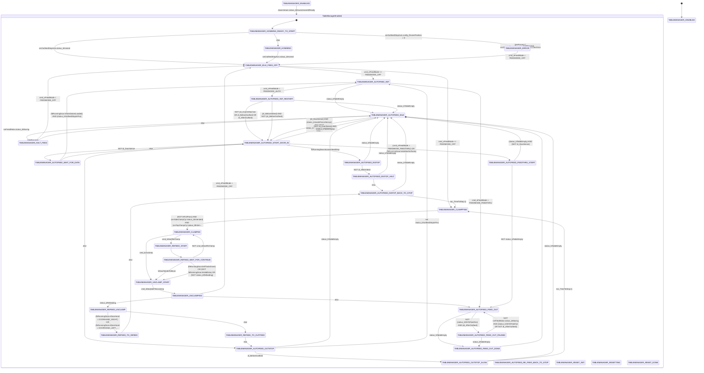

```mermaid
stateDiagram-v2
    state "TableManagerEnabled" as TableManagerEnabled {
        [*] --> TABLEMANAGER_HOMMING_READY_TO_START
        TABLEMANAGER_HOMMING_READY_TO_START
        TABLEMANAGER_HOMMING
        TABLEMANAGER_HALT_FEED
        TABLEMANAGER_IDLE_FEED_OFF
        TABLEMANAGER_CLAMPPING
        TABLEMANAGER_CLAMPED
        TABLEMANAGER_UNCLAMP_START
        TABLEMANAGER_UNCLAMPING
        TABLEMANAGER_AUTOFEED_INIT
        TABLEMANAGER_AUTOFEED_INIT_RESTART
        TABLEMANAGER_AUTOFEED_IDLE
        TABLEMANAGER_AUTOFEED_START_DOOR_IN
        TABLEMANAGER_AUTOFEED_WAIT_FOR_DATA
        TABLEMANAGER_AUTOFEED_FEEDTHRU_START
        TABLEMANAGER_AUTOFEED_INSTOP
        TABLEMANAGER_AUTOFEED_INSTOP_HALT
        TABLEMANAGER_AUTOFEED_INSTOP_BACK_TO_STOP
        TABLEMANAGER_AUTOFEED_OUTSTOP
        TABLEMANAGER_AUTOFEED_OUTSTOP_SLOW
        TABLEMANAGER_AUTOFEED_FEED_OUT
        TABLEMANAGER_AUTOFEED_FEED_OUT_PAUSED
        TABLEMANAGER_AUTOFEED_FEED_OUT_DONE
        TABLEMANAGER_AUTOFEED_RE_FEED_BACK_TO_STOP
        TABLEMANAGER_REFEED_START
        TABLEMANAGER_REFEED_WAIT_FOR_CONTINUE
        TABLEMANAGER_REFEED_UNCLAMP
        TABLEMANAGER_REFEED_TO_INFEED
        TABLEMANAGER_REFEED_TO_OUTFEED
        TABLEMANAGER_RESET_INIT
        TABLEMANAGER_RESETTING
        TABLEMANAGER_RESET_DONE
        TABLEMANAGER_ERROR
    }
    [*] --> TABLEMANAGER_DISABLED
    TABLEMANAGER_ENABLING --> TableManagerEnabled: downstream.status_bDownstreamAllReady
    TABLEMANAGER_HOMMING_READY_TO_START --> TABLEMANAGER_ERROR: smOutfeedStopAxis.config_fHomePosition = 0
    TABLEMANAGER_HOMMING_READY_TO_START --> TABLEMANAGER_IDLE_FEED_OFF: smOutfeedStopAxis.status_bHomed
    TABLEMANAGER_HOMMING_READY_TO_START --> TABLEMANAGER_HOMMING: else
    TABLEMANAGER_HOMMING --> TABLEMANAGER_IDLE_FEED_OFF: smOutfeedStopAxis.status_bHomed
    TABLEMANAGER_HALT_FEED --> TABLEMANAGER_IDLE_FEED_OFF: cmd_eFeedMode = FEEDMODE_OFF
    TABLEMANAGER_HALT_FEED --> TABLEMANAGER_AUTOFEED_IDLE: else
    TABLEMANAGER_IDLE_FEED_OFF --> TABLEMANAGER_AUTOFEED_INIT: cmd_eFeedMode <> FEEDMODE_OFF
    TABLEMANAGER_IDLE_FEED_OFF --> TABLEMANAGER_CLAMPPING: cmd_eFeedMode <> FEEDMODE_OFF
    TABLEMANAGER_CLAMPPING --> TABLEMANAGER_CLAMPED: (NOT bFirstPass) AND (smSideClampCyl.status_bExtended) AND (smTopClampCyl.status_bExten...
    TABLEMANAGER_CLAMPED --> TABLEMANAGER_UNCLAMP_START: cmd_bUnclamp
    TABLEMANAGER_CLAMPED --> TABLEMANAGER_REFEED_START: cmd_bStartReClamp
    TABLEMANAGER_UNCLAMP_START --> TABLEMANAGER_UNCLAMPING: cmd_bSeqSafeToUnclamp
    TABLEMANAGER_UNCLAMPING --> TABLEMANAGER_IDLE_FEED_OFF: cmd_eFeedMode = FEEDMODE_OFF
    TABLEMANAGER_UNCLAMPING --> TABLEMANAGER_REFEED_UNCLAMP: status_bRefeeding
    TABLEMANAGER_UNCLAMPING --> TABLEMANAGER_AUTOFEED_FEED_OUT: else
    TABLEMANAGER_AUTOFEED_INIT --> TABLEMANAGER_AUTOFEED_IDLE: status_bTableEmpty
    TABLEMANAGER_AUTOFEED_INIT --> TABLEMANAGER_AUTOFEED_INIT_RESTART: cmd_eFeedMode = FEEDMODE_AUTO
    TABLEMANAGER_AUTOFEED_INIT --> TABLEMANAGER_AUTOFEED_FEED_OUT: cmd_eFeedMode = FEEDMODE_FEEDTHRU
    TABLEMANAGER_AUTOFEED_INIT_RESTART --> TABLEMANAGER_AUTOFEED_START_DOOR_IN: NOT (di_DoorInMachine OR di_BeforeOutfeed OR di_AfterOutfeed)
    TABLEMANAGER_AUTOFEED_INIT_RESTART --> TABLEMANAGER_AUTOFEED_IDLE: status_bTableEmpty
    TABLEMANAGER_AUTOFEED_INIT_RESTART --> TABLEMANAGER_AUTOFEED_START_DOOR_IN: (di_BeforeInfeed) AND NOT (di_BeforeOutfeed)
    TABLEMANAGER_AUTOFEED_IDLE --> TABLEMANAGER_HALT_FEED: smFeedMotor.status_bMoving
    TABLEMANAGER_AUTOFEED_IDLE --> TABLEMANAGER_AUTOFEED_START_DOOR_IN: (di_DoorSense) AND (status_bInsideFenceSensor) AND (NOT status_bOutsideFenceSensor) AND...
    TABLEMANAGER_AUTOFEED_START_DOOR_IN --> TABLEMANAGER_AUTOFEED_IDLE: (NOT di_DoorSense) AND (status_bTableEmpty)
    TABLEMANAGER_AUTOFEED_START_DOOR_IN --> TABLEMANAGER_AUTOFEED_FEEDTHRU_START: (cmd_eFeedMode = FEEDMODE_FEEDTHRU) OR (fbRunningDoor.bJobHasNoTasks)
    TABLEMANAGER_AUTOFEED_START_DOOR_IN --> TABLEMANAGER_AUTOFEED_WAIT_FOR_DATA: NOT di_DoorSense
    TABLEMANAGER_AUTOFEED_START_DOOR_IN --> TABLEMANAGER_AUTOFEED_INSTOP: fbRunningDoor.bUsesInfeedStop
    TABLEMANAGER_AUTOFEED_START_DOOR_IN --> TABLEMANAGER_AUTOFEED_OUTSTOP: else
    TABLEMANAGER_AUTOFEED_WAIT_FOR_DATA --> TABLEMANAGER_AUTOFEED_INIT: (fbRunningDoor.bTaskDataIsLoaded) AND (status_bOutfeedStopInPos)
    TABLEMANAGER_AUTOFEED_WAIT_FOR_DATA --> TABLEMANAGER_AUTOFEED_START_DOOR_IN: else
    TABLEMANAGER_AUTOFEED_FEEDTHRU_START --> TABLEMANAGER_AUTOFEED_IDLE: (status_bTableEmpty) AND (NOT di_DoorSense)
    TABLEMANAGER_AUTOFEED_FEEDTHRU_START --> TABLEMANAGER_AUTOFEED_FEED_OUT: NOT status_bTableEmpty
    TABLEMANAGER_AUTOFEED_INSTOP --> TABLEMANAGER_AUTOFEED_IDLE: status_bTableEmpty
    TABLEMANAGER_AUTOFEED_INSTOP --> TABLEMANAGER_AUTOFEED_INSTOP_HALT: NOT di_AfterInfeed
    TABLEMANAGER_AUTOFEED_INSTOP_HALT --> TABLEMANAGER_AUTOFEED_IDLE: status_bTableEmpty
    TABLEMANAGER_AUTOFEED_INSTOP_HALT --> TABLEMANAGER_AUTOFEED_INSTOP_BACK_TO_STOP: else
    TABLEMANAGER_AUTOFEED_INSTOP_BACK_TO_STOP --> TABLEMANAGER_AUTOFEED_IDLE: status_bTableEmpty
    TABLEMANAGER_AUTOFEED_INSTOP_BACK_TO_STOP --> TABLEMANAGER_CLAMPPING: ton_TimeToStop.Q
    TABLEMANAGER_AUTOFEED_OUTSTOP --> TABLEMANAGER_AUTOFEED_IDLE: status_bTableEmpty
    TABLEMANAGER_AUTOFEED_OUTSTOP --> TABLEMANAGER_AUTOFEED_INIT: not status_bOutfeedStopInPos
    TABLEMANAGER_AUTOFEED_OUTSTOP --> TABLEMANAGER_AUTOFEED_OUTSTOP_SLOW: di_BeforeOutfeed
    TABLEMANAGER_AUTOFEED_OUTSTOP_SLOW --> TABLEMANAGER_AUTOFEED_IDLE: status_bTableEmpty
    TABLEMANAGER_AUTOFEED_OUTSTOP_SLOW --> TABLEMANAGER_CLAMPPING: ton_TimeToStop.Q
    TABLEMANAGER_AUTOFEED_FEED_OUT --> TABLEMANAGER_AUTOFEED_FEED_OUT_DONE: status_bTableEmpty
    TABLEMANAGER_AUTOFEED_FEED_OUT --> TABLEMANAGER_AUTOFEED_FEED_OUT_PAUSED: NOT (status_bOkToFeedOut) AND (di_AfterOutfeed)
    TABLEMANAGER_AUTOFEED_FEED_OUT_PAUSED --> TABLEMANAGER_AUTOFEED_FEED_OUT_DONE: status_bTableEmpty
    TABLEMANAGER_AUTOFEED_FEED_OUT_PAUSED --> TABLEMANAGER_AUTOFEED_FEED_OUT: NOT smFeedMotor.status_bMoving AND (status_bOkToFeedOut OR NOT di_AfterOutfeed)
    TABLEMANAGER_AUTOFEED_FEED_OUT_DONE --> TABLEMANAGER_AUTOFEED_IDLE
    TABLEMANAGER_REFEED_START --> TABLEMANAGER_REFEED_WAIT_FOR_CONTINUE
    TABLEMANAGER_REFEED_WAIT_FOR_CONTINUE --> TABLEMANAGER_UNCLAMP_START: bDoorNeedsToMove
    TABLEMANAGER_REFEED_WAIT_FOR_CONTINUE --> TABLEMANAGER_UNCLAMP_START: (fbRunningDoor.bAllTasksDone) OR (NOT fbRunningDoor.bValidData) OR (NOT status_bRefeeding)
    TABLEMANAGER_REFEED_WAIT_FOR_CONTINUE --> TABLEMANAGER_CLAMPED: NOT cmd_bStartReClamp
    TABLEMANAGER_REFEED_UNCLAMP --> TABLEMANAGER_REFEED_TO_INFEED: (fbRunningDoor.eDoorHand = DOORHAND_RIGHT) OR (fbRunningDoor.eDoorHand = DOORHAND_LEFT_...
    TABLEMANAGER_REFEED_UNCLAMP --> TABLEMANAGER_REFEED_TO_OUTFEED: else
    TABLEMANAGER_REFEED_TO_INFEED --> TABLEMANAGER_AUTOFEED_INSTOP_BACK_TO_STOP: else
    TABLEMANAGER_REFEED_TO_OUTFEED --> TABLEMANAGER_AUTOFEED_OUTSTOP: else
    TABLEMANAGER_ERROR --> TABLEMANAGER_IDLE_FEED_OFF: cmd_eFeedMode = FEEDMODE_OFF
    TableManagerEnabled --> TABLEMANAGER_HALT_FEED: [preProcess]
    TableManagerEnabled --> TABLEMANAGER_ERROR: [preProcess] smOutfeedStopAxis.fbMC_MoveAbsolute.Error
    TableManagerEnabled --> TABLEMANAGER_ERROR: [preProcess]
```
