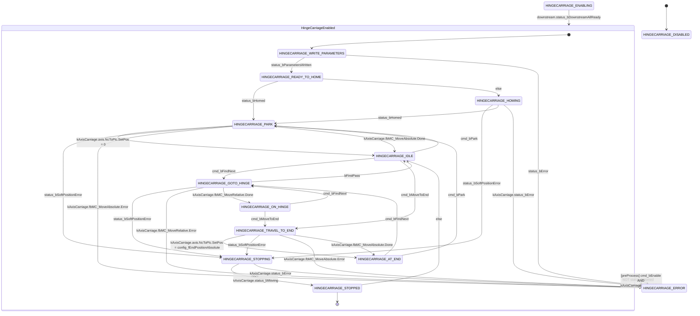

```mermaid
stateDiagram-v2
    state "HingeCarriageEnabled" as HingeCarriageEnabled {
        [*] --> HINGECARRIAGE_WRITE_PARAMETERS
        HINGECARRIAGE_WRITE_PARAMETERS
        HINGECARRIAGE_READY_TO_HOME
        HINGECARRIAGE_HOMING
        HINGECARRIAGE_PARK
        HINGECARRIAGE_IDLE
        HINGECARRIAGE_GOTO_HINGE
        HINGECARRIAGE_ON_HINGE
        HINGECARRIAGE_TRAVEL_TO_END
        HINGECARRIAGE_AT_END
        HINGECARRIAGE_STOPPING
        HINGECARRIAGE_STOPPED
        HINGECARRIAGE_STOPPED --> [*]
    }
    [*] --> HINGECARRIAGE_DISABLED
    HINGECARRIAGE_ENABLING --> HingeCarriageEnabled: downstream.status_bDownstreamAllReady
    HINGECARRIAGE_WRITE_PARAMETERS --> HINGECARRIAGE_READY_TO_HOME: status_bParametersWritten
    HINGECARRIAGE_WRITE_PARAMETERS --> HINGECARRIAGE_ERROR: status_bError
    HINGECARRIAGE_READY_TO_HOME --> HINGECARRIAGE_PARK: status_bHomed
    HINGECARRIAGE_READY_TO_HOME --> HINGECARRIAGE_HOMING: else
    HINGECARRIAGE_HOMING --> HINGECARRIAGE_STOPPING: status_bSoftPositionError
    HINGECARRIAGE_HOMING --> HINGECARRIAGE_PARK: status_bHomed
    HINGECARRIAGE_HOMING --> HINGECARRIAGE_ERROR: kAxisCarriage.status_bError
    HINGECARRIAGE_PARK --> HINGECARRIAGE_IDLE: kAxisCarriage.axis.NcToPlc.SetPos = 0
    HINGECARRIAGE_PARK --> HINGECARRIAGE_STOPPING: status_bSoftPositionError
    HINGECARRIAGE_PARK --> HINGECARRIAGE_ERROR: kAxisCarriage.fbMC_MoveAbsolute.Error
    HINGECARRIAGE_PARK --> HINGECARRIAGE_IDLE: kAxisCarriage.fbMC_MoveAbsolute.Done
    HINGECARRIAGE_IDLE --> HINGECARRIAGE_GOTO_HINGE: cmd_bFindNext
    HINGECARRIAGE_IDLE --> HINGECARRIAGE_TRAVEL_TO_END: cmd_bMoveToEnd
    HINGECARRIAGE_IDLE --> HINGECARRIAGE_PARK: cmd_bPark
    HINGECARRIAGE_GOTO_HINGE --> HINGECARRIAGE_IDLE: bFirstPass
    HINGECARRIAGE_GOTO_HINGE --> HINGECARRIAGE_STOPPING: status_bSoftPositionError
    HINGECARRIAGE_GOTO_HINGE --> HINGECARRIAGE_ERROR: kAxisCarriage.fbMC_MoveRelative.Error
    HINGECARRIAGE_GOTO_HINGE --> HINGECARRIAGE_ON_HINGE: kAxisCarriage.fbMC_MoveRelative.Done
    HINGECARRIAGE_ON_HINGE --> HINGECARRIAGE_GOTO_HINGE: cmd_bFindNext
    HINGECARRIAGE_ON_HINGE --> HINGECARRIAGE_TRAVEL_TO_END: cmd_bMoveToEnd
    HINGECARRIAGE_TRAVEL_TO_END --> HINGECARRIAGE_AT_END: kAxisCarriage.axis.NcToPlc.SetPos = config_fEndPositionAbsolute
    HINGECARRIAGE_TRAVEL_TO_END --> HINGECARRIAGE_STOPPING: status_bSoftPositionError
    HINGECARRIAGE_TRAVEL_TO_END --> HINGECARRIAGE_ERROR: kAxisCarriage.fbMC_MoveAbsolute.Error
    HINGECARRIAGE_TRAVEL_TO_END --> HINGECARRIAGE_AT_END: kAxisCarriage.fbMC_MoveAbsolute.Done
    HINGECARRIAGE_AT_END --> HINGECARRIAGE_PARK: cmd_bPark
    HINGECARRIAGE_AT_END --> HINGECARRIAGE_GOTO_HINGE: cmd_bFindNext
    HINGECARRIAGE_STOPPING --> HINGECARRIAGE_STOPPED: NOT kAxisCarriage.status_bMoving
    HINGECARRIAGE_STOPPING --> HINGECARRIAGE_ERROR: kAxisCarriage.status_bError
    HingeCarriageEnabled --> HINGECARRIAGE_ERROR: NOT status_bHomed
    HINGECARRIAGE_STOPPED --> HINGECARRIAGE_IDLE: else
    HingeCarriageEnabled --> HINGECARRIAGE_ERROR: [preProcess] cmd_bEnable AND kAxisCarriage.status_bError
```
