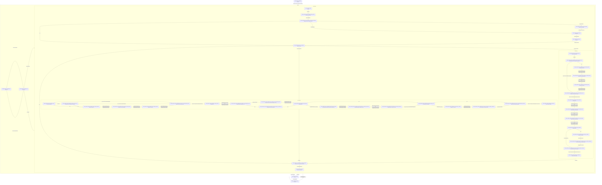

```mermaid
flowchart TD
    subgraph Enabled["Enabled"]
        DOOR_DASHER_AUTOFEED_OFF["DOOR_DASHER_AUTOFEED_OFF<br/>Autofeed Off"]
        DOOR_DASHER_AUTOFEED_ON["DOOR_DASHER_AUTOFEED_ON<br/>Autofeed On"]
        subgraph DoordashSeq["DoordashSeq"]
            DOOR_DASHER_START["DOOR_DASHER_START<br/>Starting"]
            DOOR_DASHER_WAIT_FOR_SOURCE_TABLE_READY["DOOR_DASHER_WAIT_FOR_SOURCE_TABLE_READY<br/>Wait for Source Ready"]
            DOOR_DASHER_WAIT_FOR_SOURCE_AND_TARGET_EXTERNAL["DOOR_DASHER_WAIT_FOR_SOURCE_AND_TARGET_EXTERNAL<br/>Waiting for Source and Target External"]
            DOOR_DASHER_CENTER_DOOR_PRE_ROTATE["DOOR_DASHER_CENTER_DOOR_PRE_ROTATE<br/>Center Door Pre-Rotate"]
            DOOR_DASHER_ROTATE_DOOR["DOOR_DASHER_ROTATE_DOOR<br/>Rotate Door"]
            DOOR_DASHER_ALIGN_DOOR["DOOR_DASHER_ALIGN_DOOR<br/>Align Door"]
            DOOR_DASHER_READY_TO_TRANSFER["DOOR_DASHER_READY_TO_TRANSFER<br/>Ready to Transfer"]
            DOOR_DASHER_SET_SOURCE_AND_TARGET_INTERNAL["DOOR_DASHER_SET_SOURCE_AND_TARGET_INTERNAL<br/>Setting Source and Target in Internal State"]
            DOOR_DASHER_COMPLETE["DOOR_DASHER_COMPLETE<br/>Door Dasher Complete"]
            subgraph CrossTransfer["CrossTransfer"]
                DOOR_DASHER_CROSS_TRANSFER_START["DOOR_DASHER_CROSS_TRANSFER_START<br/>Cross Transfer Starting"]
                DOOR_DASHER_CROSS_TRANSFER_ACTIVATE_CROSS_CYLS["DOOR_DASHER_CROSS_TRANSFER_ACTIVATE_CROSS_CYLS<br/>Activating Source and Target Cross Cylinders"]
                DOOR_DASHER_CROSS_TRANSFER_START_SOURCE_MOTOR["DOOR_DASHER_CROSS_TRANSFER_START_SOURCE_MOTOR<br/>Starting Source Motor"]
                DOOR_DASHER_CROSS_TRANSFER_FIND_SOURCE_EYE_RISING_EDGE["DOOR_DASHER_CROSS_TRANSFER_FIND_SOURCE_EYE_RISING_EDGE<br/>Finding Source Eye Rising Edge"]
                DOOR_DASHER_CROSS_TRANSFER_STOP_SOURCE_MOTOR["DOOR_DASHER_CROSS_TRANSFER_STOP_SOURCE_MOTOR<br/>Stopping Source Motor"]
                DOOR_DASHER_CROSS_TRANSFER_WAIT_FOR_ALL_DOORDASHERS_READY["DOOR_DASHER_CROSS_TRANSFER_WAIT_FOR_ALL_DOORDASHERS_READY<br/>Waiting for All Door Dashers Ready"]
                DOOR_DASHER_CROSS_TRANSFER_START_MOTORS["DOOR_DASHER_CROSS_TRANSFER_START_MOTORS<br/>Starting Motors"]
                DOOR_DASHER_CROSS_TRANSFER_FIND_TARGET_EYE_RISING_EDGE_PRE["DOOR_DASHER_CROSS_TRANSFER_FIND_TARGET_EYE_RISING_EDGE_PRE<br/>Finding Target Eye Rising Edge - Pre"]
                DOOR_DASHER_CROSS_TRANSFER_FIND_TARGET_EYE_RISING_EDGE_POST["DOOR_DASHER_CROSS_TRANSFER_FIND_TARGET_EYE_RISING_EDGE_POST<br/>Finding (Conveyor) Target Eye Rising Edge - POST"]
                DOOR_DASHER_CROSS_TRANSFER_FIND_RISING_OR_FALLING_EDGE_OF_TARGET_EYE["DOOR_DASHER_CROSS_TRANSFER_FIND_RISING_OR_FALLING_EDGE_OF_TARGET_EYE<br/>Finding (Non-Conveyor) Target Eye"]
                DOOR_DASHER_CROSS_TRANSFER_STOP_MOTORS["DOOR_DASHER_CROSS_TRANSFER_STOP_MOTORS<br/>Stopping Motors"]
                DOOR_DASHER_CROSS_TRANSFER_RESTART_TARGET_MOTOR["DOOR_DASHER_CROSS_TRANSFER_RESTART_TARGET_MOTOR<br/>Restarting Target and Reverse Direction for Wide Door"]
                DOOR_DASHER_CROSS_TRANSFER_FIND_RISING_EDGE_OF_TARGET_FENCE_EYE["DOOR_DASHER_CROSS_TRANSFER_FIND_RISING_EDGE_OF_TARGET_FENCE_EYE<br/>Finding Rising Edge of Target-Fence Eye"]
                DOOR_DASHER_CROSS_TRANSFER_STOP_MOTORS_ON_TARGET_FENCE_EYE["DOOR_DASHER_CROSS_TRANSFER_STOP_MOTORS_ON_TARGET_FENCE_EYE<br/>Stopping Motors on Target Fence Eye"]
                DOOR_DASHER_CROSS_TRANSFER_DEACTIVATE_CROSS_CYLS["DOOR_DASHER_CROSS_TRANSFER_DEACTIVATE_CROSS_CYLS<br/>Deactivating Cross Cylinders"]
                DOOR_DASHER_CROSS_TRANSFER_ALIGN_DOOR_AT_TARGET["DOOR_DASHER_CROSS_TRANSFER_ALIGN_DOOR_AT_TARGET<br/>Aligning Door at Target"]
                DOOR_DASHER_CROSS_TRANSFER_WAIT_FOR_ALIGN_DOOR_AT_TARGET_COMPLETE["DOOR_DASHER_CROSS_TRANSFER_WAIT_FOR_ALIGN_DOOR_AT_TARGET_COMPLETE<br/>Wait for Align Door at Target Complete"]
                DOOR_DASHER_CROSS_TRANSFER_WAIT_FOR_ALL_DOORDASHERS_COMPLETE["DOOR_DASHER_CROSS_TRANSFER_WAIT_FOR_ALL_DOORDASHERS_COMPLETE<br/>Wait for All Door Dashers Complete"]
                DOOR_DASHER_CROSS_TRANSFER_COMPLETE["DOOR_DASHER_CROSS_TRANSFER_COMPLETE<br/>Cross Transfer Complete"]
            end
            subgraph InlineTransfer["InlineTransfer"]
                DOOR_DASHER_INLINE_TRANSFER_START["DOOR_DASHER_INLINE_TRANSFER_START<br/>Inline Transfer Starting"]
                DOOR_DASHER_INLINE_TRANSFER_DEACTIVATE_CROSS_CYLS["DOOR_DASHER_INLINE_TRANSFER_DEACTIVATE_CROSS_CYLS<br/>Deactivating Source and Target Cross Cylinders"]
                DOOR_DASHER_INLINE_TRANSFER_START_SOURCE_MOTOR["DOOR_DASHER_INLINE_TRANSFER_START_SOURCE_MOTOR<br/>Starting Source Motor"]
                DOOR_DASHER_INLINE_TRANSFER_FIND_SOURCE_EYE_RISING_EDGE["DOOR_DASHER_INLINE_TRANSFER_FIND_SOURCE_EYE_RISING_EDGE<br/>Finding Source Eye Rising Edge"]
                DOOR_DASHER_INLINE_TRANSFER_STOP_SOURCE_MOTOR["DOOR_DASHER_INLINE_TRANSFER_STOP_SOURCE_MOTOR<br/>Stopping Source Motor"]
                DOOR_DASHER_INLINE_TRANSFER_WAIT_FOR_ALL_DOORDASHERS_READY["DOOR_DASHER_INLINE_TRANSFER_WAIT_FOR_ALL_DOORDASHERS_READY<br/>Waiting for All Door Dashers Ready"]
                DOOR_DASHER_INLINE_TRANSFER_START_MOTORS["DOOR_DASHER_INLINE_TRANSFER_START_MOTORS<br/>Starting Motors"]
                DOOR_DASHER_INLINE_TRANSFER_FIND_TARGET_EYE_RISING_EDGE["DOOR_DASHER_INLINE_TRANSFER_FIND_TARGET_EYE_RISING_EDGE<br/>Finding Target Eye Rising Edge"]
                DOOR_DASHER_INLINE_TRANSFER_FIND_TARGET_EYE_FALLING_EDGE["DOOR_DASHER_INLINE_TRANSFER_FIND_TARGET_EYE_FALLING_EDGE<br/>Finding Target Eye Falling Edge"]
                DOOR_DASHER_INLINE_TRANSFER_STOP_MOTORS["DOOR_DASHER_INLINE_TRANSFER_STOP_MOTORS<br/>Stopping Motors"]
                DOOR_DASHER_INLINE_TRANSFER_FEEDIN_DOOR_AT_TARGET["DOOR_DASHER_INLINE_TRANSFER_FEEDIN_DOOR_AT_TARGET<br/>Feedin Door at Target"]
                DOOR_DASHER_INLINE_TRANSFER_WAIT_FOR_FEEDIN_DOOR_AT_TARGET_COMPLETE["DOOR_DASHER_INLINE_TRANSFER_WAIT_FOR_FEEDIN_DOOR_AT_TARGET_COMPLETE<br/>Wait for Feedin Door at Target Complete"]
                DOOR_DASHER_INLINE_TRANSFER_WAIT_FOR_ALL_DOORDASHERS_COMPLETE["DOOR_DASHER_INLINE_TRANSFER_WAIT_FOR_ALL_DOORDASHERS_COMPLETE<br/>Wait for All Door Dashers Complete"]
                DOOR_DASHER_INLINE_TRANSFER_COMPLETE["DOOR_DASHER_INLINE_TRANSFER_COMPLETE<br/>Inline Transfer Complete"]
            end
        end
    end
    DOOR_DASHER_DISABLED["DOOR_DASHER_DISABLED<br/>Disabled"]
    DOOR_DASHER_ENABLING["DOOR_DASHER_ENABLING<br/>Enabling"]
    DOOR_DASHER_ERROR["DOOR_DASHER_ERROR<br/>Error"]
    startNode((" ")) --> DOOR_DASHER_DISABLED
    DOOR_DASHER_ENABLING -->|"downstream.status_bDownstreamAllReady"| Enabled
    DOOR_DASHER_AUTOFEED_OFF -->|"cmd_bAutoFeedOn"| DOOR_DASHER_AUTOFEED_ON
    DOOR_DASHER_AUTOFEED_ON -->|"NOT cmd_bAutoFeedOn"| DOOR_DASHER_AUTOFEED_OFF
    DOOR_DASHER_AUTOFEED_ON -->|"cmd_bDoorDash"| DoordashSeq
    DOOR_DASHER_START -->|"cmd_bNext"| DOOR_DASHER_WAIT_FOR_SOURCE_TABLE_READY
    DOOR_DASHER_WAIT_FOR_SOURCE_TABLE_READY -->|"bSourceTableReady"| DOOR_DASHER_WAIT_FOR_SOURCE_AND_TARGET_EXTERNAL
    DOOR_DASHER_WAIT_FOR_SOURCE_AND_TARGET_EXTERNAL -->|"cmd_bCenterDoor"| DOOR_DASHER_CENTER_DOOR_PRE_ROTATE
    DOOR_DASHER_WAIT_FOR_SOURCE_AND_TARGET_EXTERNAL -->|"cmd_bRotateDoor"| DOOR_DASHER_ROTATE_DOOR
    DOOR_DASHER_WAIT_FOR_SOURCE_AND_TARGET_EXTERNAL -->|"else"| DOOR_DASHER_READY_TO_TRANSFER
    DOOR_DASHER_CENTER_DOOR_PRE_ROTATE -->|"ftrigSelfCenterComplete.Q"| DOOR_DASHER_ROTATE_DOOR
    DOOR_DASHER_ROTATE_DOOR -->|"ftrigRotateComplete.Q"| DOOR_DASHER_ALIGN_DOOR
    DOOR_DASHER_ALIGN_DOOR -->|"ftrigAlignComplete.Q"| DOOR_DASHER_READY_TO_TRANSFER
    DOOR_DASHER_READY_TO_TRANSFER -->|"cmd_bCrossTransfer"| CrossTransfer
    DOOR_DASHER_READY_TO_TRANSFER -->|"cmd_bInlineTransfer"| InlineTransfer
    DOOR_DASHER_READY_TO_TRANSFER -->|"else"| DOOR_DASHER_SET_SOURCE_AND_TARGET_INTERNAL
    DOOR_DASHER_CROSS_TRANSFER_START -->|"pdi_crossSourceFeedEyeRisingEdge^"| DOOR_DASHER_CROSS_TRANSFER_WAIT_FOR_ALL_DOORDASHERS_READY
    DOOR_DASHER_CROSS_TRANSFER_START -->|"else"| DOOR_DASHER_CROSS_TRANSFER_START_SOURCE_MOTOR
    DOOR_DASHER_CROSS_TRANSFER_START -->|"cmd_bNext"| DOOR_DASHER_CROSS_TRANSFER_ACTIVATE_CROSS_CYLS
    DOOR_DASHER_CROSS_TRANSFER_ACTIVATE_CROSS_CYLS -->|"pdi_crossSourceFeedEyeRisingEdge^"| DOOR_DASHER_CROSS_TRANSFER_WAIT_FOR_ALL_DOORDASHERS_READY
    DOOR_DASHER_CROSS_TRANSFER_ACTIVATE_CROSS_CYLS -->|"else"| DOOR_DASHER_CROSS_TRANSFER_START_SOURCE_MOTOR
    DOOR_DASHER_CROSS_TRANSFER_START_SOURCE_MOTOR -->|"rtrigSourceMotorMoving.Q OR (config_bNoHardwareTestMode AND tTimeInState>T#35;0.25S)"| DOOR_DASHER_CROSS_TRANSFER_FIND_SOURCE_EYE_RISING_EDGE
    DOOR_DASHER_CROSS_TRANSFER_FIND_SOURCE_EYE_RISING_EDGE -->|"rtrigSourceFeedEye.Q OR (config_bNoHardwareTestMode AND tTimeInState>T#35;0.25S)"| DOOR_DASHER_CROSS_TRANSFER_STOP_SOURCE_MOTOR
    DOOR_DASHER_CROSS_TRANSFER_STOP_SOURCE_MOTOR -->|"ftrigSourceMotorMoving.Q OR (config_bNoHardwareTestMode AND tTimeInState>T#35;0.25S)"| DOOR_DASHER_CROSS_TRANSFER_WAIT_FOR_ALL_DOORDASHERS_READY
    DOOR_DASHER_CROSS_TRANSFER_WAIT_FOR_ALL_DOORDASHERS_READY -->|"rtrigSourceLeadingAndTrailingNeighborsReady.Q"| DOOR_DASHER_CROSS_TRANSFER_START_MOTORS
    DOOR_DASHER_CROSS_TRANSFER_START_MOTORS -->|"rtrigAllTablesMotorsMoving.Q OR (config_bNoHardwareTestMode AND tTimeInState>T#35;5.25S)"| DOOR_DASHER_CROSS_TRANSFER_FIND_TARGET_EYE_RISING_EDGE_PRE
    DOOR_DASHER_CROSS_TRANSFER_FIND_TARGET_EYE_RISING_EDGE_PRE -->|"bIsConveyorAtTarget"| DOOR_DASHER_CROSS_TRANSFER_FIND_TARGET_EYE_RISING_EDGE_POST
    DOOR_DASHER_CROSS_TRANSFER_FIND_TARGET_EYE_RISING_EDGE_PRE -->|"else"| DOOR_DASHER_CROSS_TRANSFER_FIND_RISING_OR_FALLING_EDGE_OF_TARGET_EYE
    DOOR_DASHER_CROSS_TRANSFER_FIND_TARGET_EYE_RISING_EDGE_POST -->|"rtrigTargetFeedEyePost.Q OR (config_bNoHardwareTestMode AND tTimeInState>T#35;0.25S)"| DOOR_DASHER_CROSS_TRANSFER_STOP_MOTORS
    DOOR_DASHER_CROSS_TRANSFER_FIND_RISING_OR_FALLING_EDGE_OF_TARGET_EYE -->|"else"| DOOR_DASHER_CROSS_TRANSFER_STOP_MOTORS
    DOOR_DASHER_CROSS_TRANSFER_STOP_MOTORS -->|"cmd_bReverseDirectionForWideDoor"| DOOR_DASHER_CROSS_TRANSFER_RESTART_TARGET_MOTOR
    DOOR_DASHER_CROSS_TRANSFER_STOP_MOTORS -->|"else"| DOOR_DASHER_CROSS_TRANSFER_DEACTIVATE_CROSS_CYLS
    DOOR_DASHER_CROSS_TRANSFER_RESTART_TARGET_MOTOR -->|"rtrigTargetMotorMoving.Q OR (config_bNoHardwareTestMode AND tTimeInState>T#35;0.25S)"| DOOR_DASHER_CROSS_TRANSFER_FIND_RISING_EDGE_OF_TARGET_FENCE_EYE
    DOOR_DASHER_CROSS_TRANSFER_FIND_RISING_EDGE_OF_TARGET_FENCE_EYE -->|"rtrigCrossTargetFenceStopEye.Q OR (config_bNoHardwareTestMode AND tTimeInState>T#35;0.25S)"| DOOR_DASHER_CROSS_TRANSFER_STOP_MOTORS_ON_TARGET_FENCE_EYE
    DOOR_DASHER_CROSS_TRANSFER_STOP_MOTORS_ON_TARGET_FENCE_EYE -->|"bTargetTransferTableCandDsideDoorFeedEyesClear"| DOOR_DASHER_CROSS_TRANSFER_DEACTIVATE_CROSS_CYLS
    DOOR_DASHER_CROSS_TRANSFER_DEACTIVATE_CROSS_CYLS -->|"NOT bIsConveyorAtTarget"| DOOR_DASHER_CROSS_TRANSFER_ALIGN_DOOR_AT_TARGET
    DOOR_DASHER_CROSS_TRANSFER_DEACTIVATE_CROSS_CYLS -->|"else"| DOOR_DASHER_CROSS_TRANSFER_WAIT_FOR_ALL_DOORDASHERS_COMPLETE
    DOOR_DASHER_CROSS_TRANSFER_ALIGN_DOOR_AT_TARGET -->|"bAligningDoorStarted OR (config_bNoHardwareTestMode AND tTimeInState>T#35;0.25S)"| DOOR_DASHER_CROSS_TRANSFER_WAIT_FOR_ALIGN_DOOR_AT_TARGET_COMPLETE
    DOOR_DASHER_CROSS_TRANSFER_WAIT_FOR_ALIGN_DOOR_AT_TARGET_COMPLETE -->|"bAligningDoorComplete"| DOOR_DASHER_CROSS_TRANSFER_WAIT_FOR_ALL_DOORDASHERS_COMPLETE
    DOOR_DASHER_CROSS_TRANSFER_WAIT_FOR_ALL_DOORDASHERS_COMPLETE -->|"rtrigSourceLeadingAndTrailingNeighborsComplete.CLK"| DOOR_DASHER_CROSS_TRANSFER_COMPLETE
    CrossTransfer -->|"cmd_bNext"| DOOR_DASHER_SET_SOURCE_AND_TARGET_INTERNAL
    DOOR_DASHER_INLINE_TRANSFER_START -->|"cmd_bNext"| DOOR_DASHER_INLINE_TRANSFER_DEACTIVATE_CROSS_CYLS
    DOOR_DASHER_INLINE_TRANSFER_DEACTIVATE_CROSS_CYLS -->|"pdi_inlineSourceFeedEyeRisingEdge^"| DOOR_DASHER_INLINE_TRANSFER_WAIT_FOR_ALL_DOORDASHERS_READY
    DOOR_DASHER_INLINE_TRANSFER_DEACTIVATE_CROSS_CYLS -->|"else"| DOOR_DASHER_INLINE_TRANSFER_START_SOURCE_MOTOR
    DOOR_DASHER_INLINE_TRANSFER_START_SOURCE_MOTOR -->|"rtrigSourceMotorMoving.Q OR (config_bNoHardwareTestMode AND tTimeInState>T#35;0.25S)"| DOOR_DASHER_INLINE_TRANSFER_FIND_SOURCE_EYE_RISING_EDGE
    DOOR_DASHER_INLINE_TRANSFER_FIND_SOURCE_EYE_RISING_EDGE -->|"rtrigInlineSourceFeedEye.Q OR (config_bNoHardwareTestMode AND tTimeInState>T#35;0.25S)"| DOOR_DASHER_INLINE_TRANSFER_STOP_SOURCE_MOTOR
    DOOR_DASHER_INLINE_TRANSFER_STOP_SOURCE_MOTOR -->|"ftrigSourceMotorMoving.Q OR (config_bNoHardwareTestMode AND tTimeInState>T#35;0.25S)"| DOOR_DASHER_INLINE_TRANSFER_WAIT_FOR_ALL_DOORDASHERS_READY
    DOOR_DASHER_INLINE_TRANSFER_WAIT_FOR_ALL_DOORDASHERS_READY -->|"rtrigSourceLeadingAndTrailingNeighborsReady.Q"| DOOR_DASHER_INLINE_TRANSFER_START_MOTORS
    DOOR_DASHER_INLINE_TRANSFER_START_MOTORS -->|"rtrigAllTablesMotorsMoving.Q OR (config_bNoHardwareTestMode AND tTimeInState>T#35;5.25S)"| DOOR_DASHER_INLINE_TRANSFER_FIND_TARGET_EYE_RISING_EDGE
    DOOR_DASHER_INLINE_TRANSFER_FIND_TARGET_EYE_RISING_EDGE -->|"rtrigInlineTargetFeedEyeRising.Q OR (config_bNoHardwareTestMode AND tTimeInState>T#35;0.25S)"| DOOR_DASHER_INLINE_TRANSFER_FIND_TARGET_EYE_FALLING_EDGE
    DOOR_DASHER_INLINE_TRANSFER_FIND_TARGET_EYE_FALLING_EDGE -->|"ftrigInlineTargetFeedEyeFalling.Q OR (config_bNoHardwareTestMode AND tTimeInState>T#35;0.25S)"| DOOR_DASHER_INLINE_TRANSFER_STOP_MOTORS
    DOOR_DASHER_INLINE_TRANSFER_STOP_MOTORS -->|"bIsTargetBufferTable"| DOOR_DASHER_INLINE_TRANSFER_WAIT_FOR_ALL_DOORDASHERS_COMPLETE
    DOOR_DASHER_INLINE_TRANSFER_STOP_MOTORS -->|"else"| DOOR_DASHER_INLINE_TRANSFER_FEEDIN_DOOR_AT_TARGET
    DOOR_DASHER_INLINE_TRANSFER_FEEDIN_DOOR_AT_TARGET -->|"bFeedingInDoorStarted"| DOOR_DASHER_INLINE_TRANSFER_WAIT_FOR_FEEDIN_DOOR_AT_TARGET_COMPLETE
    DOOR_DASHER_INLINE_TRANSFER_WAIT_FOR_FEEDIN_DOOR_AT_TARGET_COMPLETE -->|"bFeedingInDoorComplete"| DOOR_DASHER_INLINE_TRANSFER_WAIT_FOR_ALL_DOORDASHERS_COMPLETE
    DOOR_DASHER_INLINE_TRANSFER_WAIT_FOR_ALL_DOORDASHERS_COMPLETE -->|"rtrigSourceLeadingAndTrailingNeighborsComplete.CLK"| DOOR_DASHER_INLINE_TRANSFER_COMPLETE
    InlineTransfer -->|"cmd_bNext"| DOOR_DASHER_SET_SOURCE_AND_TARGET_INTERNAL
    DOOR_DASHER_SET_SOURCE_AND_TARGET_INTERNAL -->|"NOT bAnyTableExternal"| DOOR_DASHER_COMPLETE
    DoordashSeq -->|"cmd_bNext"| DOOR_DASHER_AUTOFEED_ON
    DOOR_DASHER_ERROR -->|"NOT cmd_bEnable"| DOOR_DASHER_DISABLED
    DOOR_DASHER_ERROR -->|"cmd_bReset"| Enabled
    Enabled -->|"[preProcess] NOT cmd_bEnable"| DOOR_DASHER_DISABLED
    Enabled -->|"[preProcess] bError"| DOOR_DASHER_ERROR
```
