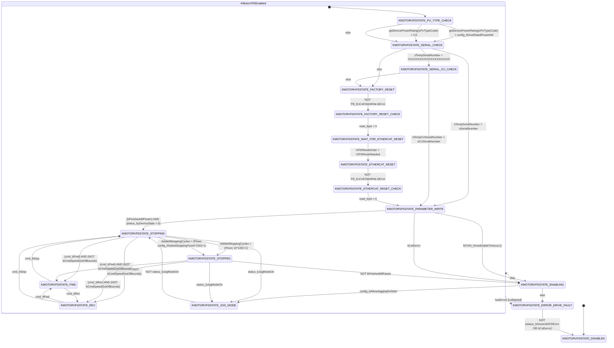

```mermaid
stateDiagram-v2
    state "KMotorVFDEnabled" as KMotorVFDEnabled {
        [*] --> KMOTORVFDSTATE_PU_TYPE_CHECK
        KMOTORVFDSTATE_PU_TYPE_CHECK
        KMOTORVFDSTATE_SERIAL_CHECK
        KMOTORVFDSTATE_SERIAL_CU_CHECK
        KMOTORVFDSTATE_FACTORY_RESET
        KMOTORVFDSTATE_FACTORY_RESET_CHECK
        KMOTORVFDSTATE_WAIT_FOR_ETHERCAT_RESET
        KMOTORVFDSTATE_ETHERCAT_RESET
        KMOTORVFDSTATE_ETHERCAT_RESET_CHECK
        KMOTORVFDSTATE_PARAMETER_WRITE
        KMOTORVFDSTATE_STOPPING
        KMOTORVFDSTATE_STOPPED
        KMOTORVFDSTATE_FWD
        KMOTORVFDSTATE_REV
        KMOTORVFDSTATE_JOG_MODE
    }
    [*] --> KMOTORVFDSTATE_DISABLED
    KMOTORVFDSTATE_ENABLING --> KMOTORVFDSTATE_JOG_MODE: config_bAllowJoggingOnStart
    KMOTORVFDSTATE_ENABLING --> KMOTORVFDSTATE_ERROR_DRIVE_FAULT: else
    KMOTORVFDSTATE_ENABLING --> KMotorVFDEnabled: else
    KMOTORVFDSTATE_PU_TYPE_CHECK --> KMOTORVFDSTATE_SERIAL_CHECK: getDevicePowerRating(sPUTypeCode) = config_fDriveRatedPowerkW
    KMOTORVFDSTATE_PU_TYPE_CHECK --> KMOTORVFDSTATE_SERIAL_CHECK: getDevicePowerRating(sPUTypeCode) = 0.0
    KMOTORVFDSTATE_PU_TYPE_CHECK --> KMOTORVFDSTATE_SERIAL_CHECK: else
    KMOTORVFDSTATE_SERIAL_CHECK --> KMOTORVFDSTATE_SERIAL_CU_CHECK: sTempSerialNumber = 'XXXXXXXXXXXXXXXXXXXXXX'
    KMOTORVFDSTATE_SERIAL_CHECK --> KMOTORVFDSTATE_PARAMETER_WRITE: sTempSerialNumber = sSerialNumber
    KMOTORVFDSTATE_SERIAL_CHECK --> KMOTORVFDSTATE_FACTORY_RESET: else
    KMOTORVFDSTATE_SERIAL_CU_CHECK --> KMOTORVFDSTATE_PARAMETER_WRITE: sTempCUSerialNumber = sCUSerialNumber
    KMOTORVFDSTATE_SERIAL_CU_CHECK --> KMOTORVFDSTATE_FACTORY_RESET: else
    KMOTORVFDSTATE_FACTORY_RESET --> KMOTORVFDSTATE_FACTORY_RESET_CHECK: NOT FB_EcCoESdoWrite.bError
    KMOTORVFDSTATE_FACTORY_RESET_CHECK --> KMOTORVFDSTATE_WAIT_FOR_ETHERCAT_RESET: read_byte = 0
    KMOTORVFDSTATE_WAIT_FOR_ETHERCAT_RESET --> KMOTORVFDSTATE_ETHERCAT_RESET: iVFDResetOrder = iVFDResetNeeded
    KMOTORVFDSTATE_ETHERCAT_RESET --> KMOTORVFDSTATE_ETHERCAT_RESET_CHECK: NOT FB_EcCoESdoWrite.bError
    KMOTORVFDSTATE_ETHERCAT_RESET_CHECK --> KMOTORVFDSTATE_PARAMETER_WRITE: read_byte = 0
    KMOTORVFDSTATE_PARAMETER_WRITE --> KMOTORVFDSTATE_STOPPING: (bFinishedAllParam) AND (status_byDeviceState > 0)
    KMOTORVFDSTATE_PARAMETER_WRITE --> KMOTORVFDSTATE_ENABLING: fbTON_DriveEnableTimeout.Q
    KMOTORVFDSTATE_PARAMETER_WRITE --> KMOTORVFDSTATE_ENABLING: bCoEerror
    KMOTORVFDSTATE_STOPPING --> KMOTORVFDSTATE_STOPPED: iAddedStoppingCycles > (Floor( 10*100)+1)
    KMOTORVFDSTATE_STOPPING --> KMOTORVFDSTATE_STOPPED: iAddedStoppingCycles > (Floor( config_fAddedStoppingTimeS*100)+1)
    KMOTORVFDSTATE_STOPPING --> KMOTORVFDSTATE_FWD: (cmd_bFwd) AND (NOT bCmdSpeedOutOfBounds)
    KMOTORVFDSTATE_STOPPING --> KMOTORVFDSTATE_REV: (cmd_bRev) AND (NOT bCmdSpeedOutOfBounds)
    KMOTORVFDSTATE_STOPPING --> KMOTORVFDSTATE_JOG_MODE: status_bJogModeOn
    KMOTORVFDSTATE_STOPPED --> KMOTORVFDSTATE_ENABLING: NOT bFinishedAllParam
    KMOTORVFDSTATE_STOPPED --> KMOTORVFDSTATE_FWD: (cmd_bFwd) AND (NOT bCmdSpeedOutOfBounds)
    KMOTORVFDSTATE_STOPPED --> KMOTORVFDSTATE_REV: (cmd_bRev) AND (NOT bCmdSpeedOutOfBounds)
    KMOTORVFDSTATE_STOPPED --> KMOTORVFDSTATE_JOG_MODE: status_bJogModeOn
    KMOTORVFDSTATE_FWD --> KMOTORVFDSTATE_REV: cmd_bRev
    KMOTORVFDSTATE_FWD --> KMOTORVFDSTATE_STOPPING: cmd_bStop
    KMOTORVFDSTATE_REV --> KMOTORVFDSTATE_FWD: cmd_bFwd
    KMOTORVFDSTATE_REV --> KMOTORVFDSTATE_STOPPING: cmd_bStop
    KMOTORVFDSTATE_JOG_MODE --> KMOTORVFDSTATE_STOPPING: NOT status_bJogModeOn
    KMOTORVFDSTATE_ERROR_DRIVE_FAULT --> KMOTORVFDSTATE_DISABLED: NOT (status_bGeneralVFDError OR bCoEerror)
    KMotorVFDEnabled --> KMOTORVFDSTATE_ERROR_DRIVE_FAULT: hasErrors [collapsed]
```
