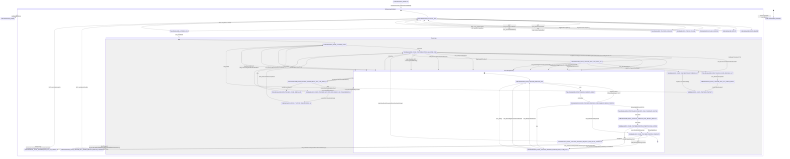

```mermaid
stateDiagram-v2
    state "TablemanagerEnabled" as TablemanagerEnabled {
        [*] --> TABLEMANAGER_AUTOFEED_OFF
        TABLEMANAGER_INLINE_JOGGING
        TABLEMANAGER_CROSS_JOGGING
        TABLEMANAGER_TO_FENCE_JOGGING
        TABLEMANAGER_ROTATE
        TABLEMANAGER_SELF_CENTER
        TABLEMANAGER_AUTOFEED_OFF
        TABLEMANAGER_AUTOFEED_ON
        TABLEMANAGER_DOOR_TRACKER_ALL_TARGET_FEEDOUT_PORTS_DISABLED
        TABLEMANAGER_DOOR_TRACKER_DOOR_HAS_NO_TARGET
        state "TrackerSeq" as TrackerSeq {
            [*] --> TABLEMANAGER_DOOR_TRACKER_START
            TABLEMANAGER_DOOR_TRACKER_START
            TABLEMANAGER_DOOR_TRACKER_WAIT_FOR_DATA_READY_OR_TRANSFERRED_IN
            TABLEMANAGER_DOOR_TRACKER_TRANSFERRING_IN
            TABLEMANAGER_DOOR_TRACKER_ROUTE_READY_WAIT_FOR_FEED_IN
            TABLEMANAGER_DOOR_TRACKER_DOOR_FEEDING_IN
            TABLEMANAGER_DOOR_TRACKER_DOOR_IN_MACHINE_IDLE
            TABLEMANAGER_DOOR_TRACKER_WAIT_FOR_FEED_OUT
            TABLEMANAGER_DOOR_TRACKER_DOOR_FEEDING_OUT
            TABLEMANAGER_DOOR_TRACKER_WAIT_ALL_TABLES_READY
            TABLEMANAGER_DOOR_TRACKER_TRANSFERRING_OUT
            TABLEMANAGER_DOOR_TRACKER_COMPLETE
            state "TrackerFindpathSeq" as TrackerFindpathSeq {
                [*] --> TABLEMANAGER_DOOR_TRACKER_FINDPATH_INIT
                TABLEMANAGER_DOOR_TRACKER_FINDPATH_INIT
                TABLEMANAGER_DOOR_TRACKER_FINDPATH_RESET
                TABLEMANAGER_DOOR_TRACKER_FINDPATH_FIND_ENABLED_FEEDOUT_PORTS
                TABLEMANAGER_DOOR_TRACKER_FINDPATH_WAITING_FOR_CLEAR_ROUTE
                TABLEMANAGER_DOOR_TRACKER_FINDPATH_FIND_CANDIDATE_ROUTES
                TABLEMANAGER_DOOR_TRACKER_FINDPATH_FIND_SEARCH_RESULTS
                TABLEMANAGER_DOOR_TRACKER_FINDPATH_COMPUTE_FINAL_SCORE
                TABLEMANAGER_DOOR_TRACKER_FINDPATH_REQUEST_NEW_ROUTE_COMPLETE
                TABLEMANAGER_DOOR_TRACKER_FINDPATH_COMPLETE
                TABLEMANAGER_DOOR_TRACKER_FINDPATH_COMPLETE --> [*]
            }
        }
    }
    [*] --> TABLEMANAGER_DISABLED
    TABLEMANAGER_ENABLING --> TablemanagerEnabled: downstream.status_bDownstreamAllReady
    TABLEMANAGER_INLINE_JOGGING --> TABLEMANAGER_AUTOFEED_OFF: NOT (cmd_bInlineTransferFwd OR cmd_bInlineTransferRev)
    TABLEMANAGER_CROSS_JOGGING --> TABLEMANAGER_AUTOFEED_OFF: NOT (cmd_bCrossTransferFwd OR cmd_bCrossTransferRev)
    TABLEMANAGER_TO_FENCE_JOGGING --> TABLEMANAGER_AUTOFEED_OFF: NOT (cmd_bToFenceFwd OR cmd_bToFenceRev)
    TABLEMANAGER_ROTATE --> TABLEMANAGER_AUTOFEED_OFF: ftrigRotateComplete.Q
    TABLEMANAGER_SELF_CENTER --> TABLEMANAGER_AUTOFEED_OFF: ftrigSelfCenterComplete.Q
    TABLEMANAGER_AUTOFEED_OFF --> TABLEMANAGER_SELF_CENTER
    TABLEMANAGER_AUTOFEED_OFF --> TABLEMANAGER_ROTATE
    TABLEMANAGER_AUTOFEED_OFF --> TABLEMANAGER_INLINE_JOGGING
    TABLEMANAGER_AUTOFEED_OFF --> TABLEMANAGER_CROSS_JOGGING
    TABLEMANAGER_AUTOFEED_OFF --> TABLEMANAGER_TO_FENCE_JOGGING
    TABLEMANAGER_AUTOFEED_OFF --> TABLEMANAGER_AUTOFEED_ON
    TABLEMANAGER_AUTOFEED_ON --> TrackerSeq: cmd_bInitialized
    TABLEMANAGER_AUTOFEED_ON --> TABLEMANAGER_AUTOFEED_OFF: NOT cmd_bAutoFeedOn
    TABLEMANAGER_DOOR_TRACKER_START --> TrackerFindpathSeq: cmd_bRequestNewRoute
    TABLEMANAGER_DOOR_TRACKER_START --> TrackerFindpathSeq: cmd_bNewTargetFeedoutPortSelected
    TABLEMANAGER_DOOR_TRACKER_START --> TrackerFindpathSeq: bHasDoor AND NOT bAnyCurrentTargetFeedoutPortEnabled
    TABLEMANAGER_DOOR_TRACKER_START --> TABLEMANAGER_DOOR_TRACKER_DOOR_IN_MACHINE_IDLE: bHasDoor
    TABLEMANAGER_DOOR_TRACKER_START --> TABLEMANAGER_DOOR_TRACKER_WAIT_FOR_DATA_READY_OR_TRANSFERRED_IN: cmd_bNext
    TABLEMANAGER_DOOR_TRACKER_WAIT_FOR_DATA_READY_OR_TRANSFERRED_IN --> TrackerFindpathSeq: cmd_bDoorDataReadyLatched
    TABLEMANAGER_DOOR_TRACKER_WAIT_FOR_DATA_READY_OR_TRANSFERRED_IN --> TABLEMANAGER_DOOR_TRACKER_TRANSFERRING_IN: cmd_bDoorTransferInStarted
    TABLEMANAGER_DOOR_TRACKER_TRANSFERRING_IN --> TABLEMANAGER_DOOR_TRACKER_DOOR_IN_MACHINE_IDLE: cmd_bDoorTransferInCompleted
    TABLEMANAGER_DOOR_TRACKER_ROUTE_READY_WAIT_FOR_FEED_IN --> TrackerFindpathSeq: cmd_bReroute
    TABLEMANAGER_DOOR_TRACKER_ROUTE_READY_WAIT_FOR_FEED_IN --> TrackerFindpathSeq: rtrigTargetFeedoutPortsDisabled.Q
    TABLEMANAGER_DOOR_TRACKER_ROUTE_READY_WAIT_FOR_FEED_IN --> TABLEMANAGER_DOOR_TRACKER_WAIT_FOR_DATA_READY_OR_TRANSFERRED_IN: NOT cmd_bDoorDataReadyLatched
    TABLEMANAGER_DOOR_TRACKER_ROUTE_READY_WAIT_FOR_FEED_IN --> TABLEMANAGER_DOOR_TRACKER_DOOR_FEEDING_IN: cmd_bFeedinStarted
    TABLEMANAGER_DOOR_TRACKER_DOOR_FEEDING_IN --> TrackerFindpathSeq: cmd_bFeedinCompleted
    TABLEMANAGER_DOOR_TRACKER_DOOR_FEEDING_IN --> TABLEMANAGER_DOOR_TRACKER_DOOR_IN_MACHINE_IDLE: else
    TABLEMANAGER_DOOR_TRACKER_DOOR_IN_MACHINE_IDLE --> TABLEMANAGER_DOOR_TRACKER_WAIT_FOR_FEED_OUT: rtrigReadyToFeedout.CLK
    TABLEMANAGER_DOOR_TRACKER_DOOR_IN_MACHINE_IDLE --> TrackerFindpathSeq: rtrigTableIndexNotExistInDoorTrackTargetPath.CLK
    TABLEMANAGER_DOOR_TRACKER_DOOR_IN_MACHINE_IDLE --> TrackerFindpathSeq: ftrigAllCurrentTargetFeedoutPortsEnabled.Q
    TABLEMANAGER_DOOR_TRACKER_DOOR_IN_MACHINE_IDLE --> TrackerFindpathSeq: cmd_bRequestNewRoute
    TABLEMANAGER_DOOR_TRACKER_DOOR_IN_MACHINE_IDLE --> TrackerFindpathSeq: cmd_bNewTargetFeedoutPortSelected
    TABLEMANAGER_DOOR_TRACKER_DOOR_IN_MACHINE_IDLE --> TABLEMANAGER_DOOR_TRACKER_TRANSFERRING_OUT: cmd_bDoorTransferOutStartedFromIdle
    TABLEMANAGER_DOOR_TRACKER_DOOR_IN_MACHINE_IDLE --> TrackerFindpathSeq: cmd_bReroute AND bIsHungryModeRouting
    TABLEMANAGER_DOOR_TRACKER_WAIT_FOR_FEED_OUT --> TABLEMANAGER_DOOR_TRACKER_DOOR_IN_MACHINE_IDLE: ftrigReadyToFeedout.Q
    TABLEMANAGER_DOOR_TRACKER_WAIT_FOR_FEED_OUT --> TrackerFindpathSeq: cmd_bReroute AND bIsHungryModeRouting
    TABLEMANAGER_DOOR_TRACKER_WAIT_FOR_FEED_OUT --> TrackerFindpathSeq: ftrigAllCurrentTargetFeedoutPortsEnabled.Q
    TABLEMANAGER_DOOR_TRACKER_WAIT_FOR_FEED_OUT --> TrackerFindpathSeq: cmd_bRequestNewRoute
    TABLEMANAGER_DOOR_TRACKER_WAIT_FOR_FEED_OUT --> TrackerFindpathSeq: cmd_bNewTargetFeedoutPortSelected
    TABLEMANAGER_DOOR_TRACKER_WAIT_FOR_FEED_OUT --> TABLEMANAGER_DOOR_TRACKER_DOOR_FEEDING_OUT: cmd_bFeedoutStarted
    TABLEMANAGER_DOOR_TRACKER_WAIT_FOR_FEED_OUT --> TABLEMANAGER_DOOR_TRACKER_TRANSFERRING_OUT: cmd_bDoorTransferOutStarted
    TABLEMANAGER_DOOR_TRACKER_DOOR_FEEDING_OUT --> TABLEMANAGER_DOOR_TRACKER_WAIT_ALL_TABLES_READY: cmd_bFeedoutCompleted
    TABLEMANAGER_DOOR_TRACKER_WAIT_ALL_TABLES_READY --> TABLEMANAGER_DOOR_TRACKER_COMPLETE: rtrigAllTablesReady.Q
    TABLEMANAGER_DOOR_TRACKER_TRANSFERRING_OUT --> TABLEMANAGER_DOOR_TRACKER_COMPLETE: ftrigDoorTransferredOut.Q
    TABLEMANAGER_DOOR_TRACKER_COMPLETE --> TABLEMANAGER_DOOR_TRACKER_START: cmd_bNext
    TABLEMANAGER_DOOR_TRACKER_FINDPATH_INIT --> TABLEMANAGER_DOOR_TRACKER_FINDPATH_FIND_ENABLED_FEEDOUT_PORTS: bHasDoor AND stDoorTrack.Source <> -1
    TABLEMANAGER_DOOR_TRACKER_FINDPATH_INIT --> TABLEMANAGER_DOOR_TRACKER_FINDPATH_RESET: else
    TABLEMANAGER_DOOR_TRACKER_FINDPATH_RESET --> TABLEMANAGER_DOOR_TRACKER_FINDPATH_FIND_ENABLED_FEEDOUT_PORTS: cmd_bNext
    TABLEMANAGER_DOOR_TRACKER_FINDPATH_FIND_ENABLED_FEEDOUT_PORTS --> TABLEMANAGER_DOOR_TRACKER_FINDPATH_FIND_CANDIDATE_ROUTES: bHasEnabledFeedoutPorts
    TABLEMANAGER_DOOR_TRACKER_FINDPATH_FIND_ENABLED_FEEDOUT_PORTS --> TABLEMANAGER_DOOR_TRACKER_FINDPATH_COMPLETE: cmd_bNewRouteRequested
    TABLEMANAGER_DOOR_TRACKER_FINDPATH_FIND_ENABLED_FEEDOUT_PORTS --> TABLEMANAGER_DOOR_TRACKER_FINDPATH_WAITING_FOR_CLEAR_ROUTE: else
    TABLEMANAGER_DOOR_TRACKER_FINDPATH_WAITING_FOR_CLEAR_ROUTE --> TABLEMANAGER_DOOR_TRACKER_FINDPATH_COMPLETE: NOT cmd_bDoorDataReadyLatched
    TABLEMANAGER_DOOR_TRACKER_FINDPATH_WAITING_FOR_CLEAR_ROUTE --> TABLEMANAGER_DOOR_TRACKER_FINDPATH_INIT: cmd_bRequestNewRoute
    TABLEMANAGER_DOOR_TRACKER_FINDPATH_WAITING_FOR_CLEAR_ROUTE --> TABLEMANAGER_DOOR_TRACKER_FINDPATH_INIT: cmd_bNewTargetFeedoutPortSelected
    TABLEMANAGER_DOOR_TRACKER_FINDPATH_WAITING_FOR_CLEAR_ROUTE --> TABLEMANAGER_DOOR_TRACKER_FINDPATH_INIT: cmd_bRetry
    TABLEMANAGER_DOOR_TRACKER_FINDPATH_FIND_CANDIDATE_ROUTES --> TABLEMANAGER_DOOR_TRACKER_FINDPATH_FIND_SEARCH_RESULTS: cmd_bNext
    TABLEMANAGER_DOOR_TRACKER_FINDPATH_FIND_SEARCH_RESULTS --> TABLEMANAGER_DOOR_TRACKER_FINDPATH_COMPUTE_FINAL_SCORE: cmd_bNext
    TABLEMANAGER_DOOR_TRACKER_FINDPATH_COMPUTE_FINAL_SCORE --> TABLEMANAGER_DOOR_TRACKER_FINDPATH_COMPLETE: bFoundValidRoute
    TABLEMANAGER_DOOR_TRACKER_FINDPATH_COMPUTE_FINAL_SCORE --> TABLEMANAGER_DOOR_TRACKER_FINDPATH_COMPLETE: cmd_bNewRouteRequested
    TABLEMANAGER_DOOR_TRACKER_FINDPATH_COMPUTE_FINAL_SCORE --> TABLEMANAGER_DOOR_TRACKER_FINDPATH_WAITING_FOR_CLEAR_ROUTE: else
    TABLEMANAGER_DOOR_TRACKER_FINDPATH_REQUEST_NEW_ROUTE_COMPLETE --> TABLEMANAGER_DOOR_TRACKER_FINDPATH_WAITING_FOR_CLEAR_ROUTE: cmd_bNewRouteRequestedFromWaitingForClearRoute
    TABLEMANAGER_DOOR_TRACKER_FINDPATH_REQUEST_NEW_ROUTE_COMPLETE --> TABLEMANAGER_DOOR_TRACKER_ALL_TARGET_FEEDOUT_PORTS_DISABLED: cmd_bNewRouteRequestedFromAllTargetFeedoutPortsDisabled
    TABLEMANAGER_DOOR_TRACKER_FINDPATH_REQUEST_NEW_ROUTE_COMPLETE --> TABLEMANAGER_DOOR_TRACKER_DOOR_HAS_NO_TARGET: cmd_bNewRouteRequestedFromDoorHasNoTarget
    TABLEMANAGER_DOOR_TRACKER_FINDPATH_REQUEST_NEW_ROUTE_COMPLETE --> TABLEMANAGER_DOOR_TRACKER_DOOR_IN_MACHINE_IDLE: cmd_bNewRouteRequestedFromDoorHasNoTarget
    TABLEMANAGER_DOOR_TRACKER_FINDPATH_REQUEST_NEW_ROUTE_COMPLETE --> TABLEMANAGER_DOOR_TRACKER_FINDPATH_COMPLETE: cmd_bNext
    TABLEMANAGER_DOOR_TRACKER_FINDPATH_COMPLETE --> TABLEMANAGER_DOOR_TRACKER_FINDPATH_REQUEST_NEW_ROUTE_COMPLETE: cmd_bRequestNewRoute
    TrackerFindpathSeq --> TABLEMANAGER_DOOR_TRACKER_DOOR_IN_MACHINE_IDLE: bHasDoor
    TrackerFindpathSeq --> TABLEMANAGER_DOOR_TRACKER_ROUTE_READY_WAIT_FOR_FEED_IN: else
    TABLEMANAGER_DOOR_TRACKER_ALL_TARGET_FEEDOUT_PORTS_DISABLED --> TrackerSeq: cmd_bRequestNewRoute
    TABLEMANAGER_DOOR_TRACKER_ALL_TARGET_FEEDOUT_PORTS_DISABLED --> TrackerSeq: cmd_bNewTargetFeedoutPortSelected
    TABLEMANAGER_DOOR_TRACKER_ALL_TARGET_FEEDOUT_PORTS_DISABLED --> TrackerSeq: ftrigAllTargetFeedoutPortsDisabled.Q
    TABLEMANAGER_DOOR_TRACKER_ALL_TARGET_FEEDOUT_PORTS_DISABLED --> TABLEMANAGER_AUTOFEED_OFF: NOT cmd_bAutoFeedOn
    TABLEMANAGER_DOOR_TRACKER_DOOR_HAS_NO_TARGET --> TrackerSeq: cmd_bRequestNewRoute
    TABLEMANAGER_DOOR_TRACKER_DOOR_HAS_NO_TARGET --> TrackerSeq: cmd_bNewTargetFeedoutPortSelected
    TABLEMANAGER_DOOR_TRACKER_DOOR_HAS_NO_TARGET --> TrackerSeq: ftrigDoorHasNoTarget.Q
    TABLEMANAGER_DOOR_TRACKER_DOOR_HAS_NO_TARGET --> TABLEMANAGER_AUTOFEED_OFF: NOT cmd_bAutoFeedOn
    TABLEMANAGER_ERROR --> TablemanagerEnabled: cmd_bReset
    TablemanagerEnabled --> TABLEMANAGER_DISABLED: [preProcess] NOT cmd_bEnable
    TablemanagerEnabled --> TABLEMANAGER_ERROR: [preProcess] bError
    TablemanagerEnabled --> TABLEMANAGER_DOOR_TRACKER_DOOR_HAS_NO_TARGET: [preProcess] ftrigNewRouteRequestedFromDoorHasNoTarget.Q OR cmd_bDoorHasNoTarget
    TrackerSeq --> TABLEMANAGER_DOOR_TRACKER_ALL_TARGET_FEEDOUT_PORTS_DISABLED: [preProcess] ftrigNewRouteRequestedFromAllTargetFeedoutPortsDisabled.Q OR rtrigAllTarge...
```
